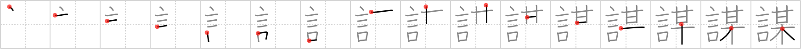

## `conspire`

## [16]

## Reading:

### On-Yomi: ボウ、ム &mdash; Kun-Yomi: はか.る、たばか.る、はかりごと

## Heisig V6:

Words . . . so-and-so.

## Koohii stories:

1) [<a href="http://kanji.koohii.com/profile/sweetneet">sweetneet</a>] 7-9-2006(240): I imagine a clique of catty girls <strong>conspiring</strong> against a another girl...they are exchanging lots of <em>words</em>, chatting about how <em>so-and-so</em> girl is now up to such-and-such (gasp!), and how they will spread the word about it.

2) [<a href="http://kanji.koohii.com/profile/CountPacula">CountPacula</a>] 2-8-2008(37): <em>Talking</em> about <em>so and so</em> behind their back.

3) [<a href="http://kanji.koohii.com/profile/mantixen">mantixen</a>] 10-7-2009(29): When you<strong> conspire</strong> against someone, you use the <em>word</em> &quot;<em>so-and-so</em>&quot; in case they or one of their friends are listening.

4) [<a href="http://kanji.koohii.com/profile/erikkusan">erikkusan</a>] 23-3-2006(15): You might hear the words of someone conspiring... &quot;If you do so-and-so...&quot;.

5) [<a href="http://kanji.koohii.com/profile/Django">Django</a>] 30-9-2007(10): Yes, it was indeed <em>Socrates</em> who<strong> conspire</strong>d with the Oompaloompas to send <em>Willy Wonka</em> up that <em>tree</em>.

6) [<a href="http://kanji.koohii.com/profile/rtkrtk">rtkrtk</a>] 7-2-2008(8): You and <em>so-and-so</em> (sitting in the tree, k-i-s-s-i-n-g) were made fun of by the schoolkids so you exchange hushed <em>words</em> to<strong> conspire</strong> against them.

7) [<a href="http://kanji.koohii.com/profile/mezbup">mezbup</a>] 1-7-2009(7): They said such and such when conspiring against so-and-so.

8) [<a href="http://kanji.koohii.com/profile/uberclimber">uberclimber</a>] 16-2-2011(6): When you<strong> conspire</strong> against the authorities, secrecy is important. Names are not exchanged, so the conspirators refer to each other by <em>say</em>ing, &quot;<em>So-and-so</em> says ~&quot; 謀 ; 籌 はかりごと plan, strategy; 謀る たばかる to work out a plan of deception, to scheme, to take in, to dupe; 謀議 ぼうぎ plot, conspiracy, conference; 謀反 むほん rebellion, uprising, insurrection.

9) [<a href="http://kanji.koohii.com/profile/Renaissance">Renaissance</a>] 18-11-2009(6): (basketman integrated in sweetneet&#039;s story) A clique of catty girls <strong>conspiring</strong> against Basket-man...they are exchanging lots of <em>words</em>, chatting about how Basketman is now up to such-and-such (gasp!), and how they will spread the word about it.

10) [<a href="http://kanji.koohii.com/profile/Neobeo">Neobeo</a>] 22-12-2008(5): Everything&#039;s a <strong>conspiracy</strong> nowadays. You can&#039;t just believe the government when they <em>say so-and-so</em>.
