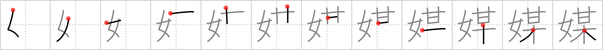

## `mediator`

## [12]

## Reading:

### On-Yomi: バイ &mdash; Kun-Yomi: なこうど

## Heisig V6:

Woman . . . so-and-so.

## Koohii stories:

1) [<a href="http://kanji.koohii.com/profile/akrodha">akrodha</a>] 4-6-2007(214): In a divorce, the <em>woman</em> needs a<strong> mediator</strong> because she won&#039;t talk to that <em>so-and-so</em>. Imagine the woman on the ground and the so-and-so up in the tree, and the poor<strong> mediator</strong> climbing up and down, trying to mediate their fight.

2) [<a href="http://kanji.koohii.com/profile/Raichu">Raichu</a>] 25-4-2007(72): In a divorce, the woman needs a<strong> mediator</strong> because she won&#039;t talk to that so-and-so.

3) [<a href="http://kanji.koohii.com/profile/Filip">Filip</a>] 2-3-2008(36): The two little gossiping girls with their lollipops are having a fight. Now an adult woman (mom or teacher) has to come between them an serve as a<strong> mediator</strong>.

4) [<a href="http://kanji.koohii.com/profile/sweetneet">sweetneet</a>] 7-9-2006(12): Well the &quot;<em>so-and-so</em>&quot;girl that was picked on in the previous frame tattled on the catty girls, and a catfight breaks out...at which point yet another <em>woman</em> was brought forth to be the<strong> mediator</strong> between their squabble. not like that would help things, but whatever...

5) [<a href="http://kanji.koohii.com/profile/Renaissance">Renaissance</a>] 18-11-2009(9): (inspired by akrodha, with basketman integrated in the story) Basketman is going through a divorce. The <em>woman</em> needs a<strong> mediator</strong> because she won&#039;t talk to Basketman. Imagine the<strong> mediator</strong> walking back and forth between the woman and Basketman, trying to understand the stuff Basketman is saying from under his basket.

6) [<a href="http://kanji.koohii.com/profile/mantixen">mantixen</a>] 10-7-2009(3): A<strong> mediator</strong> is brought in when you suspect your <em>woman</em> of cheating on you with <em>so-and-so</em>.

7) [<a href="http://kanji.koohii.com/profile/radical_tyro">radical_tyro</a>] 13-7-2007(2): A<strong> mediator</strong> is needed to solve the problems between the <em>woman</em> and <em>Mr. So-and-so</em> cause they won&#039;t talk directly.

8) [<a href="http://kanji.koohii.com/profile/KanjiHantaa">KanjiHantaa</a>] 12-4-2013(1): Un <strong>mediador</strong> va a precisar un matrimonio si descubren que la <em>mujer</em> anduvo con un <em>fulanito de tal</em>.

9) [<a href="http://kanji.koohii.com/profile/jonusbalonus">jonusbalonus</a>] 8-4-2013(1): The<strong> mediator</strong> was fortunately our favourite <em>woman</em> teacher, in the ongoing dispute between us and the greedy <a href="../1759">so-and-so</a> (#1759 某) who&#039;d stolen our sweets.

10) [<a href="http://kanji.koohii.com/profile/dannyboy4885">dannyboy4885</a>] 28-10-2012(1): <em>Willy Wonka</em> (<em>sweet/wickerbasket</em>) + <em>tree</em> = <em>Oompa Loompa</em> (<em>so-and-so</em>). An <em>Oompa Loompa</em> is going through a divorce. The <em>woman</em> needs a<strong> mediator</strong> because she won&#039;t talk to the <em>Oompa Loompa</em>.
