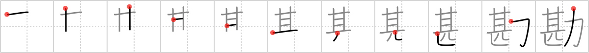

## {1769}

## `intuition`

## [11]

## Reading:

### On-Yomi: カン

## Words:

勘弁(かんべん): pardon, forgiveness, forbearance

勘(かん): perception, intuition

勘定(かんじょう): calculation, settlement of an account, allowance

勘違い(かんちがい): misunderstanding, wrong guess
