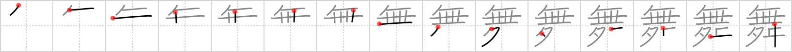

# {舞}

## `dance`

## Strokes: 15

## Reading:

### On-Yomi: ブ &mdash; Kun-Yomi: ま.う、-ま.う、まい

### Examples: 舞い (ま.い), 舞う (ま.う)

## Words:

仕舞(しまい): end, termination, informal (Noh play)

仕舞う(しまう): to finish, to close, to do something completely, to put away, to put an end to

舞う(まう): to dance, to flutter about, to revolve

見舞(みまい): enquiry, expression of sympathy, expression of concern

舞台(ぶたい): stage (theatre), scene or setting (e.g. of novel, play, etc.)

振舞う(ふるまう): behave, conduct oneself, entertain

見舞い(みまい): enquiry, expression of sympathy or concern

見舞う(みまう): ask after (health), visit

お見舞い(おみまい): asking after (a person´s health)
