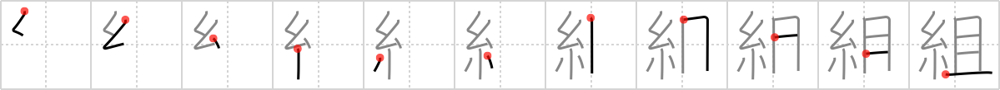

# {組}

## `association`

## Strokes: 11

## Reading:

### On-Yomi: ソ &mdash; Kun-Yomi: く.む、くみ、-ぐみ

### Examples: 組む (く.む), 組 (くみ)

## Words:

組み合わせ(くみあわせ): combination

組み合わせる(くみあわせる): to join together, to combine, to join up

組み込む(くみこむ): to insert, to include, to cut in (printing)

仕組み(しくみ): devising, plan, plot, contrivance, construction, arrangement

取り組む(とりくむ): to tackle, to wrestle with, to engage in a bout, to come to grips with

組(くみ): class, group, team, set

組合(くみあい): association, union

組み立てる(くみたてる): assemble, set up, construct

組む(くむ): put together

組織(そしき): organization, structure, construction, tissue, system

番組(ばんぐみ): TV program
