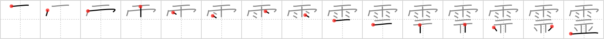

# {霊}

## `spirits`

## Strokes: 15

## Reading:

### On-Yomi: レイ、リョウ &mdash; Kun-Yomi: たま

### Examples: 霊感 (れいかん), 霊魂 (れいこん), 霊長類 (れいちょうるい), 霊 (たま)

## Words:

幽霊(ゆうれい): ghost, specter, apparition, phantom
