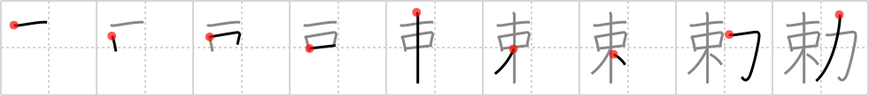

## `imperial order`

## [9]

## Reading:

### On-Yomi: チョク &mdash; Kun-Yomi: いまし.める、みことのり

## Heisig story:

In order to keep this character distinct from that for an <i>imperial edict</i> (Frame 366), we must draw again on a pun. Think of the <b>order</b> here as a mail <b>order</b> or an <b>order</b> of pizza phoned in by the Emperor for delivery to the <b>imperial</b> palace. Then it will not be hard to put together <i>bundle</i> and <i>muscle</i> to form a story about an <b>imperial order</b>.

## Koohii stories:

1) [<a href="http://kanji.koohii.com/profile/vosmiura">vosmiura</a>] 9-12-2007(248): This is an<strong> imperial order</strong> for pizza. To deliver the huge bundle of pizzas to the emperor, the pizza boy needs huge muscles.

2) [<a href="http://kanji.koohii.com/profile/RoboTact">RoboTact</a>] 21-7-2007(64): <strong>Imperial order</strong> carries quite a <em>bundle</em> of executive <em>power</em>.

3) [<a href="http://kanji.koohii.com/profile/Okonomiyaki">Okonomiyaki</a>] 26-6-2008(30): &quot;Did someone have an<strong> imperial order</strong> for pizza?&quot; says the muscular delivery boy with a large &quot;bundle&quot; in the new adult film, &quot;The Emperor&#039;s Nude Groove&quot;.

4) [<a href="http://kanji.koohii.com/profile/Virtua_Leaf">Virtua_Leaf</a>] 15-1-2008(12): The emperor makes an<strong> imperial order</strong>: A <em>bundle</em> of seafood pizzas, mainly with <em>muscles</em> for topping.

5) [<a href="http://kanji.koohii.com/profile/CountPacula">CountPacula</a>] 25-7-2008(8): A (written)<strong> imperial order</strong>: a little <em>bundle</em> of paper that carries a lot of <em>power</em>.

6) [<a href="http://kanji.koohii.com/profile/blubko">blubko</a>] 20-6-2010(6): <strong>Imperial order</strong> comes bundled with power.

7) [<a href="http://kanji.koohii.com/profile/eri401">eri401</a>] 12-6-2011(4): Don&#039;t mix up with <a href="../v4/342">imperial edict</a> (#342 詔) - the seductive words. This time the Emperor has put in an<strong> imperial order</strong> for a dinner <em>bundle</em> of 12 large pizzas, bbq chicken wings, and a 2 litre of coke. It&#039;s quite a <em>bundle</em> but he&#039;s got the <em>power</em> to order it. 勅 (P); 詔 (P) 【ちょく( 勅 )(P); みことのり(P)】 (n) imperial decree; imperial edict; (P.

8) [<a href="http://kanji.koohii.com/profile/dingomick">dingomick</a>] 10-9-2007(4): <strong>Imperial order</strong>: a <em>spinach</em> pizza, delivered in a <em>bundle</em> by a stork to keep it secret.

9) [<a href="http://kanji.koohii.com/profile/torida">torida</a>] 3-4-2010(3): This is the<strong> imperial order</strong> that (King) Herod gave to kill all <em>bundles of joy</em>, lest his <em>power</em> be under threat...

10) [<a href="http://kanji.koohii.com/profile/akrodha">akrodha</a>] 28-5-2007(3): Fed up with the incompetent clones, the Empire comissioned a new set of inexpensive but mighty soldiers made out of <em>bundles of sticks</em> and <em>artificial muscles</em>. This<strong> imperial order</strong> will produce an army that is far larger than that of the clones, and far more powerful... as long as nobody manages to untie those bundles.
