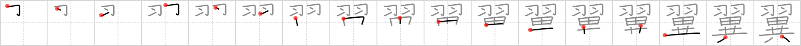

## `wing`

## [17]

## Reading:

### On-Yomi: ヨク &mdash; Kun-Yomi: つばさ

## Heisig V6:

Feathers . . . uncommon.

## Koohii stories:

1) [<a href="http://kanji.koohii.com/profile/fiminor">fiminor</a>] 20-3-2007(182): The thing about feathers is that they usually cover the entire bird. A creature with <em>feathers</em> only on its <strong>wings</strong> would be very <em>uncommon</em>.

2) [<a href="http://kanji.koohii.com/profile/Nukemarine">Nukemarine</a>] 7-12-2007(56): <strong>WING</strong>S without any FEATHERS would be an UNCOMMON site. Well, unless you like to eat chicken<strong> WING</strong>S alot.

3) [<a href="http://kanji.koohii.com/profile/LazyNomad">LazyNomad</a>] 9-7-2009(41): This is つばさ. To make a distinct image you can think about aircraft<strong> wing</strong> for which this kanji is also used. <em>Feathers</em> would be extremely <em>uncommon</em> to use in design of an aircraft<strong> wing</strong>s.

4) [<a href="http://kanji.koohii.com/profile/captal">captal</a>] 16-6-2008(24): When we talk about<strong> wing</strong>s and <strong>feathers</strong> we usually talk about 羽 , but the more <strong>uncommon</strong> form is つばさ for larger<strong> wing</strong>s- like angels - quite <strong>uncommon</strong> beings.

5) [<a href="http://kanji.koohii.com/profile/rich_f">rich_f</a>] 10-3-2008(21): Reki&#039;s <strong>wing</strong> <em>feathers</em> were an <em>uncommon</em> color among haibane--they were black instead of white.

6) [<a href="http://kanji.koohii.com/profile/mantixen">mantixen</a>] 12-7-2009(10): Up until the late Jurassic period, it was <em>uncommon</em> to find <em>feathers</em> on<strong> wing</strong>s.

7) [<a href="http://kanji.koohii.com/profile/redskatz">redskatz</a>] 6-4-2009(10): When you think of all the animals in the world that have <strong>wings</strong> (like insects), <strong>winged</strong> creatures with <em>feathers</em> are actually pretty <em>uncommon</em>.

8) [<a href="http://kanji.koohii.com/profile/Katsuo">Katsuo</a>] 3-8-2010(5): Having checked every single plane at the airport you conclude, &quot;<strong>Wing</strong>s with <em>feathers</em> are <em>uncommon</em>&quot;.

9) [<a href="http://kanji.koohii.com/profile/TheSlakey">TheSlakey</a>] 1-1-2009(5): Finding feathers on a plane&#039;s<strong> wing</strong>s would be very uncommon.

10) [<a href="http://kanji.koohii.com/profile/torida">torida</a>] 26-5-2010(4): It&#039;s <em>uncommon</em> to see a<strong> wing</strong> without <em>feathers</em> on top.
