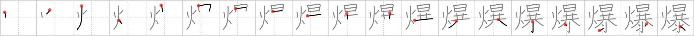

# {爆}

## `bomb`

## Strokes: 19

## Reading:

### On-Yomi: バク &mdash; Kun-Yomi: は.ぜる

## Words:

原爆(げんばく): atomic bomb

爆弾(ばくだん): bomb

爆破(ばくは): blast, explosion, blow up

爆発(ばくはつ): explosion, detonation, eruption
