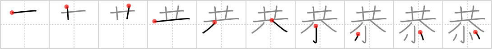

## `respect`

## [10]

## Reading:

### On-Yomi: キョウ &mdash; Kun-Yomi: うやうや.しい

## Heisig story:

Strung together . . . valentine.

## Koohii stories:

1) [<a href="http://kanji.koohii.com/profile/bihzad">bihzad</a>] 1-5-2008(149): Noah feels like he gets no<strong> respect</strong> from the other passengers on the Ark, but they all make him Valentine&#039;s Day cards to show how much they<strong> respect</strong> what he&#039;s done for them.

2) [<a href="http://kanji.koohii.com/profile/synewave">synewave</a>] 20-12-2006(109): If you wanna stay <em>together</em> you have to show your <em>valentine</em><strong> respect</strong>.

3) [<a href="http://kanji.koohii.com/profile/Katsuo">Katsuo</a>] 6-10-2007(60): As I like Aretha Franklin&#039;s song &quot;R-E-S-P-E-C-T&quot;, I cut out each of the letters from pieces of card, then <em>string</em> them all <em>together</em> and send it to her as a <em>valentine</em>.

4) [<a href="http://kanji.koohii.com/profile/samuize">samuize</a>] 7-8-2008(28): If you<strong> respect</strong> your girlfriend you will definitely spend Valentine&#039;s day together.

5) [<a href="http://kanji.koohii.com/profile/Django">Django</a>] 1-10-2007(14): As a sign of<strong> respect</strong> for all those who did not make it onto the <em>Ark</em>, Noah hung <em>valentines</em> on the underside of the <em>Ark</em>.

6) [<a href="http://kanji.koohii.com/profile/ergerg">ergerg</a>] 27-2-2007(8): Some poor guy strings together a bunch of valentines for his sweetheart. She rejects him, however, he can&#039;t get no<strong> respect</strong>. (don&#039;t confuse with <a href="../1864">pay respects</a> (#1864 伺)).

7) [<a href="http://kanji.koohii.com/profile/dingomick">dingomick</a>] 11-3-2007(5): As a sign of <strong>respect</strong>, I give my <em>two-headed monster</em> a <em>valentine</em>. It reads: Roses are red, Violets are blue, God, you&#039;re a freak, But I still love you.

8) [<a href="http://kanji.koohii.com/profile/Viking101">Viking101</a>] 11-2-2010(4): The celebrity performer on <em>Noah&#039;s</em> 40 day ark cruise was Aretha Franklin. She sang the <strong>R-E-S-P-E-C-T</strong> song over and over again. For <em>Valentine&#039;s day</em>, I sent her a candy heart that said E-N-O-U-G-H.

9) [<a href="http://kanji.koohii.com/profile/Virtua_Leaf">Virtua_Leaf</a>] 7-10-2009(3): <em>Noah</em>&#039;s wife uses an Aretha Franklin song for an audio <em>valentine</em> card to him: <strong>R-E-S-P-E-C-T</strong>, <em>Noah</em> makin&#039; history! V-A-L-T-I-N-E, show him what he means to me! (thanks Katsuo).

10) [<a href="http://kanji.koohii.com/profile/Soseki">Soseki</a>] 2-4-2008(3): <em>Love</em> must come <em>together</em> with<strong> respect</strong> in order for a relationship to succeed.
