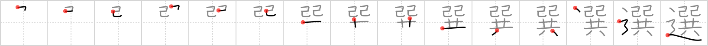

## `elect`

## [15]

## Reading:

### On-Yomi: セン &mdash; Kun-Yomi: えら.ぶ

### Examples: 選ぶ (えら.ぶ)

## Words:

選挙(せんきょ): election

選考(せんこう): selection, screening

抽選(ちゅうせん): lottery, raffle, drawing (of lots)

当選(とうせん): being elected, winning the prize

選手(せんしゅ): player (in game), team

選択(せんたく): selection, choice

選ぶ(えらぶ): choose

## Koohii stories:

1) [<a href="http://kanji.koohii.com/profile/joesan">joesan</a>] 17-12-2007(162): There were so many <em>snakes</em> on the <em>road</em> to <em>Noah&#039;s ark</em> so they had to<strong> elect</strong> which two would represent the <em>snake</em> species. 

2) [<a href="http://kanji.koohii.com/profile/Raichu">Raichu</a>] 20-6-2007(121): You&#039;re driving on the road and you see two snakes together. You can&#039;t avoid both, so you have to<strong> elect</strong> which one gets run over. 

3) [<a href="http://kanji.koohii.com/profile/nakome">nakome</a>] 27-6-2008(89): Isn&#039;t this how the US presedential<strong> elect</strong>ion works? You are given a choice between <em>two snakes</em>. Their politics are actually <em>strung together</em> but you get to feel as though you chose which one you want to lead you down the political <em>road</em> for the next four years. So which <em>snake</em> are you going to<strong> elect</strong>? 

4) [<a href="http://kanji.koohii.com/profile/Hujis">Hujis</a>] 8-6-2009(45): There isn&#039;t quite enough room on <em>Noah&#039;s Ark</em> for all the animals. So they decide to<strong> elect</strong> which two animals to kick out on to the <em>road</em>. Suprise, Suprise, they chose to get rid of the <em>two snakes</em>. 

5) [<a href="http://kanji.koohii.com/profile/meolox">meolox</a>] 24-2-2008(13): Who am I going to<strong> elect</strong>, both the candidates are <em>two snakes</em> who <em>together</em> both promise a <em>road</em> to better government, you know what I think I&#039;ll stay home on<strong> elect</strong>ion day. 

6) [<a href="http://kanji.koohii.com/profile/Nukemarine">Nukemarine</a>] 4-12-2007(12): Two SNAKES (male and female) travel to NOAH&#039;s ARK, following the path of the ROAD. They wonder if they&#039;ll be<strong> ELECT</strong>ED as leader of the animals. If not, they decide to poison any that would win. 

7) [<a href="http://kanji.koohii.com/profile/dingomick">dingomick</a>] 17-4-2007(7): Wanting to help, but not quite understanding what an <strong>elect</strong>ion is, my <em>two-headed monster</em> stands in the middle of the road with a <em>snake</em> in each hand over his head campaigning for his favorite candidate. 

8) [<a href="http://kanji.koohii.com/profile/ayoung24">ayoung24</a>] 20-12-2006(7): <strong>Elect</strong> me for president! I promise to <em>string together</em> these other <em>snakes</em> in parliament and throw them out on the <em>street</em> where they belong. 

9) [<a href="http://kanji.koohii.com/profile/chamcham">chamcham</a>] 29-3-2010(5): Two SNAKES, president and Vice President, are seemingly STRUNG TOGETHER as they hit the same places along the long campaign ROAD, hoping the voters will<strong> ELECT</strong> them. 

10) [<a href="http://kanji.koohii.com/profile/japanralf">japanralf</a>] 15-6-2008(5): In the United States it does not really matter who is <em>elect</em>ed for president - the two candidates are both <em>snakes</em> following <em>togehter</em> the same <em>road</em> of corruption. 
