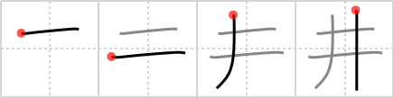

## {1806}

## `well`

## [4]

## Reading:

### On-Yomi: セイ、ショウ &mdash; Kun-Yomi: い

### Examples: 油井 (ゆい), 市井 (しせい), 井 (い)

## Words:

伊井(いい): that one, Italy

天井(てんじょう): ceiling, ceiling price

井戸(いど): water well
