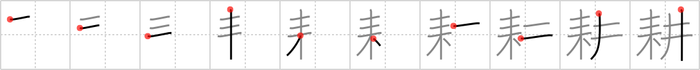

# {1808}

## `till`

## [10]

## Reading:

### On-Yomi: コウ &mdash; Kun-Yomi: たがや.す

### Examples: 耕す (たがや.す)

## Words:

耕作(こうさく): cultivation, farming

農耕(のうこう): farming, agriculture

耕地(こうち): arable land

耕す(たがやす): till, plow, cultivate
