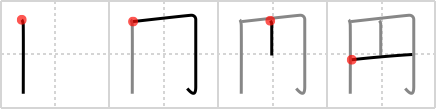

# {円}

## `circle`

## Strokes: 4

## Reading:

### On-Yomi: エン &mdash; Kun-Yomi: まる.い、まる、まど、まど.か、まろ.やか

### Examples: 円い (まる.い)

## Words:

円滑(えんかつ): harmony, smoothness

円満(えんまん): perfection, harmony, peace, smoothness, completeness, satisfaction, integrity

円(えん): yen, circle

円周(えんしゅう): circumference

楕円(だえん): ellipse

円(まる): circle, money

円い(まるい): round, circular, spherical
