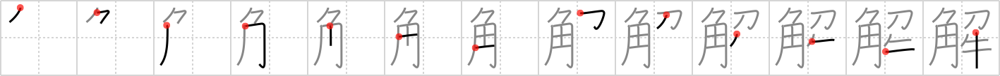

## {1814}

## `unravel`

## [13]

## Reading:

### On-Yomi: カイ、ゲ &mdash; Kun-Yomi: と.く、と.かす、と.ける、ほど.く、ほど.ける、わか.る、さと.る

### Examples: 解決 (かいけつ), 解禁 (かいきん), 理解 (りかい), 解かす (と.かす), 解く (と.く), 解ける (と.ける)

## Words:

解除(かいじょ): cancellation, rescinding, release, calling off

解剖(かいぼう): dissection, autopsy

正解(せいかい): correct, right, correct interpretation (answer solution)

弁解(べんかい): explanation, justification, defence, excuse

解く(ほどく): to unfasten

了解(りょうかい): comprehension, consent, understanding, roger (on the radio)

解決(かいけつ): settlement, solution, resolution

解散(かいさん): breakup, dissolution

解釈(かいしゃく): explanation, interpretation

解説(かいせつ): explanation, commentary

解答(かいとう): answer, solution

解放(かいほう): release, liberation, emancipation

見解(けんかい): opinion, point of view

誤解(ごかい): misunderstanding

解く(とく): solve, answer, unravel, untie

解ける(とける): loosen

分解(ぶんかい): analysis, disassembly

理解(りかい): understanding, comprehension
