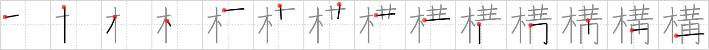

## {1818}

## `posture`

## [14]

## Reading:

### On-Yomi: コウ &mdash; Kun-Yomi: かま.える、かま.う

### Examples: 構う (かま.う), 構える (かま.える)

## Words:

構え(かまえ): posture, pose, style

構える(かまえる): to set up

機構(きこう): mechanism, organization

構想(こうそう): plan, plot, idea, conception

構う(かまう): mind, care about, be concerned about

構成(こうせい): organization, composition

構造(こうぞう): structure, construction

結構(けっこう): splendid, nice, wonderful, delicious, sweet, construction, architecture, well enough, tolerably
