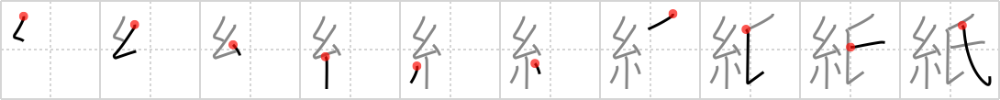

## `paper`

## [10]

## Reading:

### On-Yomi: シ &mdash; Kun-Yomi: かみ

## Koohii stories:

1) [<a href="http://kanji.koohii.com/profile/Jasta">Jasta</a>] 8-11-2008(225): <em>Spiderman</em> doesn&#039;t have a single<strong> paper</strong> with his <em>family name</em> on it (because he doesn&#039;t want to reveal his identity). 

2) [<a href="http://kanji.koohii.com/profile/fuaburisu">fuaburisu</a>] 4-12-2005(79): I imagine a ridiculously expensive, and rather pointless, Japanese type of<strong> paper</strong> for writing letters, with one&#039;s <em>family name</em> woven in <em>fine thread</em> somewhere in a corner. 

3) [<a href="http://kanji.koohii.com/profile/bihzad">bihzad</a>] 1-5-2008(39): Spiderman regrets getting drunk last night. Peter Parker hands in his<strong> paper</strong> with the name Peter Spiderman--wrong family name. Oops! 

4) [<a href="http://kanji.koohii.com/profile/torida">torida</a>] 26-5-2010(16): <em>Spiderman</em> is very careful not to leave any piece of<strong> paper</strong> lying around with his <em>family name</em> on it (because he doesn&#039;t want to reveal his identity) .......[thanks Jasta]. 

5) [<a href="http://kanji.koohii.com/profile/randomkrazy">randomkrazy</a>] 7-3-2009(9): Peter Parker&#039;s original name was Peter<strong> Paper</strong>, but they decided to change it before the comic was released. 

6) [<a href="http://kanji.koohii.com/profile/Angrybeez">Angrybeez</a>] 15-7-2008(9): <em>Spiderman</em> gets his <em>name</em> in the<strong> paper</strong>. 

7) [<a href="http://kanji.koohii.com/profile/Ricardo">Ricardo</a>] 1-7-2007(6): [paper] The first <strong>paper</strong> ever made probably had a kind of <em>thread</em>ed texture, and the <em>family name</em> of the inventors would be known until today... but they didn&#039;t get a patent for their system! 

8) [<a href="http://kanji.koohii.com/profile/dingomick">dingomick</a>] 12-3-2007(6): <em>Black Widow</em> has special writing <strong>paper</strong> with her <em>family name</em> crested at the top. 

9) [<a href="http://kanji.koohii.com/profile/Nuriko">Nuriko</a>] 5-4-2008(5): To make sure you remember that this is a family name and not just a character for &quot;name,&quot; here&#039;s an addition to Jasta&#039;s story: Spiderman has not a single<strong> paper</strong> with his family name on it. He doesn&#039;t want to reveal his identity AND he wants to make sure no one knows who he is related to. He wants to protect his family. 

10) [<a href="http://kanji.koohii.com/profile/dwhitman">dwhitman</a>] 8-2-2008(4): <em>spiderman</em> has special writing<strong> paper</strong> with his <em>family name</em> on it (not too smart for a superhero with a secret identity...) (tweaking dingomick and jasta). 
