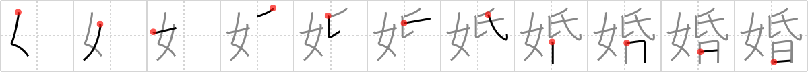

## `marriage`

## [11]

## Reading:

### On-Yomi: コン

## Koohii stories:

1) [<a href="http://kanji.koohii.com/profile/fuaburisu">fuaburisu</a>] 4-12-2005(270): <strong>Marriage</strong> is the <em>day</em> in this <em>woman</em>&#039;s life where she gets a new <em>family name</em>. 

2) [<a href="http://kanji.koohii.com/profile/Katsuo">Katsuo</a>] 20-2-2008(90): Tip: Heisig later introduces the kanji   <a href="http://jisho.org/kanji/details/昏">昏</a>   <a href="../2451">dusk</a> (#2451 <a href="http://jisho.org/kanji/details/昏">昏</a>). Story: Never enter into<strong> marriage</strong> with a <em>woman</em> at <em>dusk</em> (wait until you see them in daylight). Note: This is an ancient proverb . . . (probably). 

3) [<a href="http://kanji.koohii.com/profile/Shibo">Shibo</a>] 19-6-2008(26): My goodness, between this story and surname and matrimony.. Ouch. I apologize in advance for this one, ladies, but if I don&#039;t make this story memorable this kanji will haunt me forever. Ok, here goes:<strong> Marriage</strong> is the day a <em>woman</em> is changed forever. Not only does she get a new <em>family name</em> but she can start using her <em>mouth with a wagging tongue</em> to nag instead of those other unspeakable acts that her husband used to enjoy.. 

4) [<a href="http://kanji.koohii.com/profile/usis35">usis35</a>] 29-3-2013(24): 3 Kanji related with<strong> marriage</strong>, all the 3 with the primitive WOMAN.   <a href="http://jisho.org/kanji/details/嫁">嫁</a>   <a href="../542">marry into</a> (#542 <a href="http://jisho.org/kanji/details/嫁">嫁</a>): Since the man is hardly ever home, the woman feels more like she&#039;s married into the HOUSE .   <a href="http://jisho.org/kanji/details/姻">姻</a>   <a href="../584">matrimony</a> (#584 <a href="http://jisho.org/kanji/details/姻">姻</a>): is the state you get after the<strong> marriage</strong>, in which the woman has got you PENT IN like a DOG, so that you cannot go after other bitches.   <a href="http://jisho.org/kanji/details/婚">婚</a>   <a href="../1830">marriage</a> (#1830 <a href="http://jisho.org/kanji/details/婚">婚</a>): is &quot;THE&quot; day in this woman&#039;s life where she gets a new FAMILY NAME. Remember that<strong> MARRIAGE</strong> begins one DAY, whereas MATRIMONY is the state you get after the<strong> MARRIAGE</strong>. 

5) [<a href="http://kanji.koohii.com/profile/DavidZ">DavidZ</a>] 23-11-2009(13):   <a href="http://jisho.org/kanji/details/婿嫁婚姻">婿嫁婚姻</a>  : 4 kanji related to<strong> marriage</strong>, all with the <em>woman</em> primitive. <strong>Bridegroom</strong>: for the honeymoon, he takes her to the <em>zoo</em> for a <em>month</em>. <strong>Marry into</strong>: since the J-husband is never home, she feels more like she&#039;s married into the <em>house</em> than into a relationship. <strong>Marriage</strong>: is when she gets a new <em>family name</em> on one particular <em>day</em>. <strong>Matrimony</strong>: is the state after the<strong> marriage</strong>, where she has the husband <em>pent in</em> like a <em>dog</em>...   <a href="http://jisho.org/kanji/details/婚約">婚約</a>  [こんやく]  <a href="http://jisho.org/kanji/details/、結婚">、結婚</a>  [けっこん]  <a href="http://jisho.org/kanji/details/、離婚">、離婚</a>  [りこん]. 

6) [<a href="http://kanji.koohii.com/profile/CharleyGarrett">CharleyGarrett</a>] 23-4-2007(9): <strong>Marriage</strong> is a milestone event. The <em>woman</em>&#039;s <em>family name</em> is changed from that <em>day</em> on. 

7) [<a href="http://kanji.koohii.com/profile/fleet+street">fleet+street</a>] 17-10-2011(7): A <em>woman</em> changes her <em>family name</em> on her <em>day</em> of <strong>marriage</strong>. 

8) [<a href="http://kanji.koohii.com/profile/Captain+Kanjipants">Captain+Kanjipants</a>] 7-8-2011(7): <strong>Mawage</strong>! <strong>Mawage</strong> is what bwings us togewah to<em>day</em>. It is the <em>day</em> on which this <em>woman</em>, Buttercup, changes her <em>family name</em> to Humperdink. 

9) [<a href="http://kanji.koohii.com/profile/deadweigh">deadweigh</a>] 30-1-2012(4): A <em>woman</em> used to get a new <em>family name</em> on the <em>day</em> of her<strong> Marriage</strong>. Beware <a href="../542">marry into</a> (#542 <a href="http://jisho.org/kanji/details/嫁">嫁</a>), <a href="../584">matrimony</a> (#584 <a href="http://jisho.org/kanji/details/姻">姻</a>), and <a href="../1557">surname</a> (#1557 <a href="http://jisho.org/kanji/details/姓">姓</a>)! 

10) [<a href="http://kanji.koohii.com/profile/Perry">Perry</a>] 28-4-2010(4): <strong>Marriage</strong> is when the <em>sun</em> goes down on a <em>woman&#039;s</em> <em>family name</em>, and she gets a new one. 
