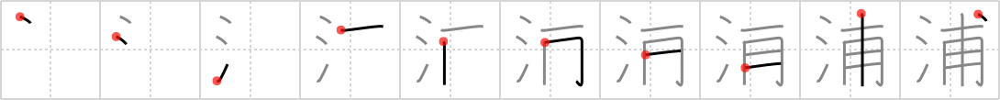

## `bay`

## [10]

## Reading:

### On-Yomi: ホ &mdash; Kun-Yomi: うら

## Koohii stories:

1) [<a href="http://kanji.koohii.com/profile/dingomick">dingomick</a>] 12-3-2007(189): The <em>water</em> of the <strong>bay</strong> washes all the <em>dog tags</em> up after the battle. 

2) [<a href="http://kanji.koohii.com/profile/taijuando">taijuando</a>] 6-6-2006(53): Imagine the opening scenes of<strong> bay</strong>watch....beautiful <em>water</em> and the <em>dog tags</em> of the cast jumping up and down as they run along the beach. 

3) [<a href="http://kanji.koohii.com/profile/Zactacular">Zactacular</a>] 30-9-2007(51): Otis Redding is sitting on the dock of the<strong> bay</strong>, looking over the <em>water</em> while clutching the <em>dog tags</em> of his fallen friend from Vietnam. 

4) [<a href="http://kanji.koohii.com/profile/koohiikun">koohiikun</a>] 10-11-2009(17): Unwanted <em>offspring</em> are often dumped in the <em>waters</em> of a<strong> bay</strong>. 

5) [<a href="http://kanji.koohii.com/profile/ayoung24">ayoung24</a>] 21-12-2006(12): My <em>aibo dog</em> [<a href="../1836">catch</a> (#1836 <a href="http://jisho.org/kanji/details/捕">捕</a>)] fell in the <em>water</em> and stopped working, so I sold it on e<strong>Bay</strong>. 

6) [<a href="http://kanji.koohii.com/profile/fuaburisu">fuaburisu</a>] 25-12-2005(8): There&#039;s a famous<strong> bay</strong> in Japan, where <em>dogtags</em> are washed by the <em>waters</em> onto the beaches.. what happened of these dogs.. who knows. Mnemonic &quot;the<strong> bay</strong> of the <em>water</em>-washed <em>dogtags</em>&quot;. 

7) [<a href="http://kanji.koohii.com/profile/sacmaliyorsun">sacmaliyorsun</a>] 4-4-2008(6): The <em>waters</em> of the famous Ha Long<strong> Bay</strong> in Vietnam are full of <em>dog tags</em> of American soldiers. 

8) [<a href="http://kanji.koohii.com/profile/gavmck">gavmck</a>] 9-1-2010(5): After the battle, the <em>water</em> washed so many <em>dog tags</em> ashore, they nicknamed it &quot;Dog Tag<strong> Bay</strong>&quot;. Mnemonic: &quot;My comrades died in the <em>waters</em> of <em>Dog Tag</em><strong> Bay</strong>&quot;. 

9) [<a href="http://kanji.koohii.com/profile/RoboTact">RoboTact</a>] 20-8-2007(5): Lifeguard dog (having an official lifeguard <em>dog tag</em>) watches this <strong>bay</strong> and diligently rescues people drowning in the <em>water</em>. 

10) [<a href="http://kanji.koohii.com/profile/sulris">sulris</a>] 25-3-2011(3): Turtles travel to monteray<strong> bay</strong> to get out of the water to make their offspring. 
