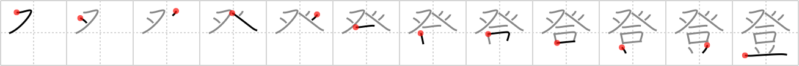

## `ascend`

## [12]

## Reading:

### On-Yomi: トウ、ト、ドウ、ショウ、チョウ &mdash; Kun-Yomi: のぼ.る、あ.がる

## Heisig story:

<i>Teepee</i> . . . <i>table</i>. Do not confuse with <i>rise up</i> (Frame 43).

## Premitive:

teepee The dots at the top of this tent are the wooden poles protruding outside the canvas walls of a teepee. [5]

## Koohii stories:

1) [<a href="http://kanji.koohii.com/profile/johnskb">johnskb</a>] 9-5-2006(283): When an American Indian warrior dies, his body is placed on a TABLE inside a TEEPEE, and a ritualistic ceremony is held to encourage his spirit to<strong> ASCEND</strong> to that big buffalo hunting ground in the sky.

2) [<a href="http://kanji.koohii.com/profile/ergerg">ergerg</a>] 4-6-2006(95): When I was a kid I went out camping in a teepee. I ate beans for dinner, and afterwards I produced so much gas that my teepee actually<strong> ascend</strong>ed in the air!

3) [<a href="http://kanji.koohii.com/profile/RoboTact">RoboTact</a>] 28-7-2007(57): Stroke order for <em>teepee</em> primitive is incorrect (in 4th edition), 3rd and 4th strokes should be reversed.

4) [<a href="http://kanji.koohii.com/profile/Perry">Perry</a>] 25-4-2010(34): <em>Mr Bean</em><strong> ascend</strong>s a <em>teepee</em>, which then collapses, flattening the American Indians trapped inside.

5) [<a href="http://kanji.koohii.com/profile/mantixen">mantixen</a>] 27-9-2008(22): The smell of a <em>bean</em> fart<strong> ascend</strong>s up, up and out the top of the <em>teepee</em>.

6) [<a href="http://kanji.koohii.com/profile/andresito">andresito</a>] 19-5-2009(8): <strong>NEW primitive; teepee.</strong> <em>Mr. Bean</em> went to an indian community, after some time he <strong>ascended</strong> to better ranks among the tribe, he now resides in a <em>teepee</em>.

7) [<a href="http://kanji.koohii.com/profile/decals">decals</a>] 8-7-2010(6): I<strong> ascend</strong> ( 登る ) to the top of the mountain. Once there, I set up camp. I put out my tee pee and make some warm bean soup.

8) [<a href="http://kanji.koohii.com/profile/CharleyGarrett">CharleyGarrett</a>] 30-1-2007(6): To <strong>ascend</strong> Mount Everest has become so common, that some rich mountaineers even take <em>teepees</em> with <em>tables</em> up to their base camp. This is the way to <strong>ascend</strong> in luxury!

9) [<a href="http://kanji.koohii.com/profile/Doodsaq">Doodsaq</a>] 17-5-2008(5): Some young Indians ate the magic beans peyote beans and slowly started to<strong> ascend</strong> from the table to the top of the teepee.

10) [<a href="http://kanji.koohii.com/profile/Teskal">Teskal</a>] 15-2-2010(3): German: Bevor man einen Berg <strong>erklimmt</strong>, gehe ins <em>Tipi</em> und esse so viele <em>Bohnen</em> wie du kannst. Das gibt zusätzlichen Antrieb.

### {V4: 1703, V6: 1838}
