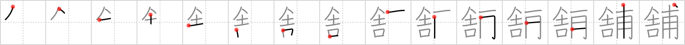

## `shop`

## [15]

## Reading:

### On-Yomi: ホ

## Words:

舗装(ほそう): pavement, road surface

## Koohii stories:

1) [<a href="http://kanji.koohii.com/profile/AryllWind">AryllWind</a>] 30-3-2008(128): A<strong> shop</strong> in an impoverished country is just a cottage with a dog tag identifying it. 

2) [<a href="http://kanji.koohii.com/profile/raulir">raulir</a>] 1-1-2007(97): Normal cottages (  <a href="http://jisho.org/kanji/details/舎">舎</a>   actually means a building) don&#039;t have tags advertising their names, but<strong> shop</strong>s do. 

3) [<a href="http://kanji.koohii.com/profile/bihzad">bihzad</a>] 1-5-2008(43): Soldiers used to go the &quot;lady-shop&quot; at the edge of town. It was a little cottage stocked with women. All you had to do was show your dogtags to be admitted. 

4) [<a href="http://kanji.koohii.com/profile/Rooboy">Rooboy</a>] 3-4-2009(13): In Vietnam there is a little <em>cottage</em> industry of<strong> shop</strong>s producing and selling fake US <em>dog tags</em>. These<strong> shop</strong>s are starting to appear in Iraq and Afghanastan too. 

5) [<a href="http://kanji.koohii.com/profile/radical_tyro">radical_tyro</a>] 15-7-2007(9): This <em>cottage</em> is a<strong> shop</strong> that sells <em>Aibo dog tags</em>. 

6) [<a href="http://kanji.koohii.com/profile/Neobeo">Neobeo</a>] 23-12-2008(8): That little <a href="../316">cottage</a> (#316 <a href="http://jisho.org/kanji/details/舎">舎</a>) there is your one-stop-shop for <em>dog tag</em>s. 

7) [<a href="http://kanji.koohii.com/profile/manubear">manubear</a>] 5-5-2012(6): This strange<strong> shop</strong> sells only <em>cottage</em> cheese and <em>dog tags</em>. People often buy both and use the dog tags as a kind of spoon to eat the cheese (  <a href="http://jisho.org/kanji/details/店舗">店舗</a>  ). 

8) [<a href="http://kanji.koohii.com/profile/johngwk">johngwk</a>] 25-8-2011(6): When you die, your COTTAGE is made into a<strong> shop</strong> by your OFFSPRING <a href="../2097">offspring</a> (#2097 <a href="http://jisho.org/kanji/details/甫">甫</a>)甫 　RTK2:　ホ　  <a href="http://jisho.org/kanji/details/店舗">店舗</a>  　てんぽ(a<strong> shop</strong>)...　 (bodhisamaya tweaked for order). 

9) [<a href="http://kanji.koohii.com/profile/rhclaghorn">rhclaghorn</a>] 11-10-2008(6): This military surplus<strong> SHOP</strong> is a small <em>cottage</em> that sells <em>dog tags</em>. 

10) [<a href="http://kanji.koohii.com/profile/sabretou">sabretou</a>] 19-3-2011(5): Think of an RPG; you enter a <em>cottage</em> that is the village<strong> shop</strong> and sell off all the <em>dog tags</em> you collected from your enemies for a reward. (Fallout: New Vegas actually lets you do this). 
