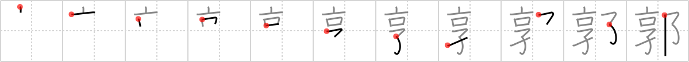

## `enclosure`

## [11]

## Reading:

### On-Yomi: カク &mdash; Kun-Yomi: くるわ

## Koohii stories:

1) [<a href="http://kanji.koohii.com/profile/Copycatken">Copycatken</a>] 21-5-2009(180): The city finally <em>received</em> the<strong> enclosure</strong> that it desperately needed, <em>city walls</em> to protect it against attacks from the <em>tall kids</em>. 

2) [<a href="http://kanji.koohii.com/profile/radical_tyro">radical_tyro</a>] 15-7-2007(79): Even the <em>tall</em> <em>kids</em> can&#039;t get out of the<strong> enclosure</strong> that is the <em>city walls</em>. 

3) [<a href="http://kanji.koohii.com/profile/zwarte_kat">zwarte_kat</a>] 18-2-2009(62): As you can see, the tall kid peaks over the<strong> enclosure</strong> of the city walls to see the red light district (one of the meanings of the kanji). 

4) [<a href="http://kanji.koohii.com/profile/scotty28">scotty28</a>] 2-8-2009(26): (primitive city walls - slum. See residence 1841) in the slums, the city walls enlose everyone within. Some of the tall kids reckon they can clamber over the enlosing city walls, but even they fail. 

5) [<a href="http://kanji.koohii.com/profile/Peppi">Peppi</a>] 26-5-2009(15): This Kanji also has the meaning of <strong>red-light district</strong> (probably an abbreviation from <a href="../2235">licensed quarters</a> (#2235 <a href="http://jisho.org/kanji/details/廓">廓</a>)). Only <em>tall kids</em> are allowed to go there and leave the<strong> enclosure</strong> through the <em>city wall</em> to <em>receive</em> what they need so desperately. 

6) [<a href="http://kanji.koohii.com/profile/jabberwockychortles">jabberwockychortles</a>] 13-1-2010(6): Despite the<strong> enclosure</strong> of the <em>city walls</em> we still <em>receive</em> a lot of things thrown into the city. 

7) [<a href="http://kanji.koohii.com/profile/ma3xiu1">ma3xiu1</a>] 4-5-2010(4): To keep the <em>tall kids</em> in the<strong> enclosure</strong>, a normal playpen won&#039;t do, you need to have <em>city walls</em>. 

8) [<a href="http://kanji.koohii.com/profile/Renaissance">Renaissance</a>] 25-7-2009(4): Mister Burns&#039; <em>receives</em> a notice whenever <em>tall kids</em> enter the<strong> enclosure</strong> of his domain. 

9) [<a href="http://kanji.koohii.com/profile/chibimizuno">chibimizuno</a>] 26-4-2009(4): <em>Mr. Burns</em> <em>receives</em> a notice whenever someone passes through the walls that act as an<strong> enclosure</strong> around his home so that he knows to release the hounds. 

10) [<a href="http://kanji.koohii.com/profile/proagg">proagg</a>] 27-3-2009(4): The<strong> enclosure</strong> that has <em>received</em> the most attention is <em>The Great Wall of China</em>. 
