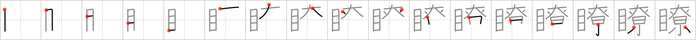

## `obvious`

## [17]

## Reading:

### On-Yomi: リョウ &mdash; Kun-Yomi: あきらか

## Heisig story:

Eye . . . pup tent.

## Koohii stories:

1) [<a href="http://kanji.koohii.com/profile/Katsuo">Katsuo</a>] 20-3-2007(58): I paint a huge <em>eye</em> on the side of my <em>pup tent</em>. Why? – It’s<strong> obvious</strong>: when I’m at the camping site it makes it<strong> obvious</strong> which tent is mine so I can quickly locate it.

2) [<a href="http://kanji.koohii.com/profile/NeoGlitch">NeoGlitch</a>] 18-2-2012(16): RevTKers please, open your <em>eye</em>s!! That&#039;s not a puptent you see! It&#039;s <em>kagaribi</em> (尞), fuel used for sacrifices. I know it wasn&#039;t<strong> obvious</strong> at first, but I hope it&#039;s clear to you now! :D.

3) [<a href="http://kanji.koohii.com/profile/gavmck">gavmck</a>] 6-3-2010(10): It&#039;s<strong> obvious</strong> that the <em>pup tent</em> with a huge <em>eye</em> on the side belongs to the dark lord Sauron.

4) [<a href="http://kanji.koohii.com/profile/fastgolfball">fastgolfball</a>] 1-10-2010(9): It is<strong> obvious</strong> that you shouldn&#039;t be staring into <em>sacred bonfires</em> with your <em>eyes</em>.

5) [<a href="http://kanji.koohii.com/profile/astridtops">astridtops</a>] 21-1-2007(6): Open your <em>eyes</em>, it&#039;s<strong> obvious</strong> that not all of us can fit into that small <em>puptent</em>!

6) [<a href="http://kanji.koohii.com/profile/sabretou">sabretou</a>] 24-4-2013(2): While we were sitting down at the camp having our dinner, Tom kept <em>eyeing</em> Mary and subtly motioning towards the <em>pup tent</em>. It was<strong> obvious</strong> to us all what his eyes were going on about, but Mary remained confused.

7) [<a href="http://kanji.koohii.com/profile/kapalama">kapalama</a>] 23-8-2011(2): 明瞭な , 一目瞭然の , <a href="../v4/2582">obvious</a> (#2582 瞭) リョウ(尞), ( 名乗り : あきら) ... Parts: 目 , 尞 (cf 療 <a href="../v4/1709">heal</a> (#1709 療), 同僚 <a href="../v4/1707">colleague</a> (#1707 僚), 寮 <a href="../v4/1708">dormitory</a> (#1708 寮), 尞<a href="../v4/23582">Unicode-0x5c1e</a> (#23582 尞)) ... Story: If your <em>Colleague</em> is Mr.T, it&#039;s<strong> Obvious</strong> all <em>Eyeballs</em> will be on him not you.

8) [<a href="http://kanji.koohii.com/profile/dihutenosa">dihutenosa</a>] 4-8-2008(2): Your group of friends all go out for a long camping trip. Everyone brings single <em>pup tents</em>, and it&#039;s a blast. The second night, though, start hanging with a friend (of the attractive sex) ...and you two sort of hit it off. You try to keep it a secret from the rest of your group...but it&#039;s starting to get<strong> obvious</strong>. You&#039;re always <em>eyeing</em> each other in group activities...your friend says &quot;Come on, just say it...it&#039;s totally<strong> obvious</strong>. I put my eye up to her <em>pup tent</em> last night and saw you two in there.&quot;.

9) [<a href="http://kanji.koohii.com/profile/Norman">Norman</a>] 14-2-2013(1): All EYES were watching the flames intensely. It&#039;s<strong> OBVIOUS</strong> this was no ordinary fire, but a SACRED BONFIRE.

10) [<a href="http://kanji.koohii.com/profile/einahpets">einahpets</a>] 29-2-2012(1): Open your <em>eyes</em>! That&#039;s no ordinary fire, it&#039;s a <em>sacred bonfire</em>. It&#039;s so<strong> obvious</strong>! In fact there&#039;s no ordinary fire to be seen here.

### {V4: 2582, V6: 1843}
