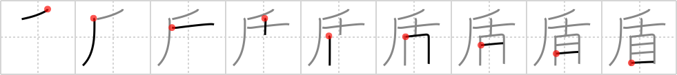

## `shield`

## [9]

## Reading:

### On-Yomi: ジュン &mdash; Kun-Yomi: たて

### Examples: 盾 (たて)

## Words:

盾(たて): shield, buckler, escutcheon, pretext

矛盾(むじゅん): contradiction, inconsistency

## Koohii stories:

1) [<a href="http://kanji.koohii.com/profile/fuaburisu">fuaburisu</a>] 4-9-2007(236): This is a magic<strong> shield</strong> with <em>ten eyes</em> which have the power to <em>drag</em> the victim towards it. 

2) [<a href="http://kanji.koohii.com/profile/ergerg">ergerg</a>] 16-8-2006(52): You paint 10 huge eyes on your<strong> shield</strong> to scare the enemy, but consequently your<strong> shield</strong> is so big and heavy that you have to drag it. 

3) [<a href="http://kanji.koohii.com/profile/akrodha">akrodha</a>] 10-6-2007(45): From Wikipedia: &quot;If a Spartan hoplite were to return to Sparta alive and without his<strong> shield</strong>, it was assumed that he threw his<strong> shield</strong> at the enemy in an effort to flee; an act punishable by death or banishment.&quot; Picture the enemy of a Spartan soldier poking his <em>eyes</em> out with a <em>sewing needle</em> and trying to steal his<strong> shield</strong>. However, the Spartan desperately clutches on, and is <em>dragged around</em> for a while, preferring to die than to lose his<strong> shield</strong>. 

4) [<a href="http://kanji.koohii.com/profile/romanrozhok">romanrozhok</a>] 5-7-2008(12): TEN EYES = BEHOLDER. You use your<strong> SHIELD</strong> to block the BEHOLDERS rays and bounce them back on him. You DRAG his head home victorious.　. 

5) [<a href="http://kanji.koohii.com/profile/Renaissance">Renaissance</a>] 12-3-2010(8): Girls are being taught that if someone tries to drag them away, they should poke the harasser&#039;s eyes out with a needle. This type of precaution is well known, so harassers nowadays prepare themselves by carrying eyeshields, in order to deflect the needles. 

6) [<a href="http://kanji.koohii.com/profile/gfb345">gfb345</a>] 2-6-2010(6): This<strong> SHIELD</strong> is a <em>cross</em> between <em>AXE</em> (  <a href="http://jisho.org/kanji/details/斤">斤</a>   <a href="../1125">axe</a> (#1125 <a href="http://jisho.org/kanji/details/斤">斤</a>)) and <em>NOSE</em> (  <a href="http://jisho.org/kanji/details/自">自</a>   <a href="../36">oneself</a> (#36 <a href="http://jisho.org/kanji/details/自">自</a>)), to commemorate that it has broken many <em>AXE</em>s that were meant to break my <em>NOSE</em>. 

7) [<a href="http://kanji.koohii.com/profile/efeilliaid">efeilliaid</a>] 14-2-2010(5): You are a glorious winner coming back home. You hold your<strong> shield</strong> in one hand and drag a ten-eyed head of a monster behind you. 

8) [<a href="http://kanji.koohii.com/profile/Everyl">Everyl</a>] 17-7-2009(5): This <strong>shield</strong> is the legendary Aegis of Greek legend, made using Medusa&#039;s head. Most of her snake-hair has fallen out now, but she still has <em>ten eyes</em> left. 

9) [<a href="http://kanji.koohii.com/profile/mspertus">mspertus</a>] 22-9-2006(4): It&#039;s a real <em>drag</em> if your<strong> shield</strong> is only as big as an <em>eye</em> of a <em>needle</em>. 

10) [<a href="http://kanji.koohii.com/profile/Virtua_Leaf">Virtua_Leaf</a>] 10-10-2009(3): Someone chucks a <em>pin</em> at you! You heroically <em>drag</em> someone in front of you and use them as a human <em>shield</em>, the <em>pin</em> going in their <em>eye</em>. 
