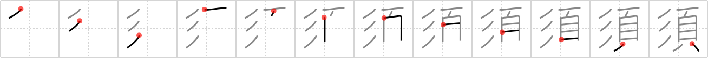

## `ought`

## [12]

## Reading:

### On-Yomi: ス、シュ &mdash; Kun-Yomi: すべから.く、すべし、ひげ、まつ、もち.いる、もと.める

## Heisig story:

<i>Shape</i> . . . <i>head</i>. This is the only time that <i>shape</i> is placed to the left of its relative element, the <i>head</i>.

## Koohii stories:

1) [<a href="http://kanji.koohii.com/profile/ergerg">ergerg</a>] 28-7-2006(140): Why, I<strong> OUGHT</strong> to RESHAPE your HEAD...

2) [<a href="http://kanji.koohii.com/profile/Airymon">Airymon</a>] 15-4-2008(101): Since this Kanji is exceptional, the <em>shape</em><strong> ought</strong> to be on the left side. Got that into your <em>head</em>?

3) [<a href="http://kanji.koohii.com/profile/adrianbarritt">adrianbarritt</a>] 9-1-2008(57): You<strong> ought</strong> to like the <em>shape</em> of your <em>head</em> because you can&#039;t change it.

4) [<a href="http://kanji.koohii.com/profile/akrodha">akrodha</a>] 31-5-2007(25): A little kid decorates his sleeping grandpa&#039;s <em>head</em> with <em>Play-Doh</em>: horns, moustache, boogers, earwax, moles. He knows mommy will come along and tell him he<strong> ought</strong>n&#039;t do it, but he does it anyway.

5) [<a href="http://kanji.koohii.com/profile/ayoung24">ayoung24</a>] 15-12-2006(14): <em>Mystique</em> the shape-shifter [<a href="../1710">carve</a> (#1710 彫)]<strong> ought</strong> to use her <em>head after</em> choosing a form, otherwise she might forget who she is.

6) [<a href="http://kanji.koohii.com/profile/MeisterLlama">MeisterLlama</a>] 10-4-2009(12): This is not &quot;ought&quot; (see: <a href="http://dic.yahoo.co.jp/dsearch?enc=UTF-8&amp;p=%E9%A0%88&amp;dtype=0&amp;dname=0na&amp;stype=0&amp;pagenum=1&amp;index=09820120954200">http://dic.yahoo.co.jp/dsearch?enc=UTF-8&amp;p=%E9%A0%88&amp;dtype=0&amp;dname=0na&amp;stype=0&amp;pagenum=1&amp;index=09820120954200</a>) A better keyword is &quot;essential&quot;. There&#039;s a reason why they make children play with playdoh. Playdoh has essential proteins for the development of the head. If you don&#039;t play with playdoh, your head will start to lose its shape and eventually become a shapeless blob.

7) [<a href="http://kanji.koohii.com/profile/pm215">pm215</a>] 2-6-2008(10): In philosophy a distinction is sometimes drawn between &quot;<strong>ought</strong>&quot; and &quot;is&quot;. &quot;is&quot; statements are describing the real world; but &quot;<strong>ought</strong>&quot; statements describe morality -- they exist only inside your <em>head</em> but they <em>shape</em> your behaviour significantly... [Primitive placement: rather than thinking about this as a special case for <em>shape</em> you might prefer to remember that <em>head</em> is _never_ on the left side of any kanji.].

8) [<a href="http://kanji.koohii.com/profile/Terhorst">Terhorst</a>] 22-11-2007(9): <em>Mystique</em> must be out of sorts today. She<strong> ought</strong> to know better than to change her body but forget to change her <em>head</em>!

9) [<a href="http://kanji.koohii.com/profile/rtkrtk">rtkrtk</a>] 5-2-2008(8): <em>Bruce Lee</em> lectured his students on his philosophy. &quot;Instead of trying to win all of your street fights, you<strong> ought</strong> to use your <em>head</em> more often to avoid getting into fights in the first place.&quot;.

10) [<a href="http://kanji.koohii.com/profile/gavmck">gavmck</a>] 7-8-2010(6): This kanji is the wrong shape. Shape (彡)<strong> ought</strong> to be on the right. It&#039;s &quot;not right in the <em>head</em>&quot;!
