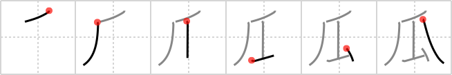

## `melon`

## [6]

## Reading:

### On-Yomi: カ、ケ &mdash; Kun-Yomi: うり

## Heisig story:

The only thing that distinguishes this from the <i>claw</i> is the addition of the <i>elbow</i>, made by doubling up the third stroke and adding a fourth.

## Koohii stories:

1) [<a href="http://kanji.koohii.com/profile/yorkii">yorkii</a>] 8-7-2006(312): 何これ ???? ok, sorry to be crude... if you claw at a girls<strong> melon</strong>s, she is gonna give you the elbow.

2) [<a href="http://kanji.koohii.com/profile/Christoph">Christoph</a>] 14-2-2007(62): M for<strong> melon</strong>. 瓜 elon.

3) [<a href="http://kanji.koohii.com/profile/RoboTact">RoboTact</a>] 25-8-2007(33): Vegetarian <em>vultures</em> are fighting for a <strong>melon</strong>, each trying to <em>elbow</em> its way to it with <em>claws</em>.

4) [<a href="http://kanji.koohii.com/profile/imojyochu">imojyochu</a>] 3-1-2009(25): The housewives <em>CLAW</em>ed and <em>ELBOW</em>ed each other to buy the first<strong> MELON</strong> of the season.

5) [<a href="http://kanji.koohii.com/profile/raulir">raulir</a>] 2-1-2007(15): To top yorkii&#039;s crudeness: while girls have juicy<strong> melon</strong>s on them, they are well protected with claws and elbows.

6) [<a href="http://kanji.koohii.com/profile/torida">torida</a>] 26-5-2010(11): I tried to get into the<strong> melon</strong> with my <em>claws</em>, but it wasn&#039;t working. So I put it on a hard surface and smashed it with my <em>elbow</em> instead... success!

7) [<a href="http://kanji.koohii.com/profile/snallygaster">snallygaster</a>] 29-5-2008(9): I don&#039;t know what Heisig is going on (in the 4th ed) about saying the elbow is drawn with 3 strokes -- his own diagram and stroke count (5) shows it&#039;s drawn in the normal 2-stroke way, and the stroke diagrams at WWWJDIC agree. So I would suggest that the stroke count here is wrong and that this kanji is normally considered 5 strokes. Anyway, like yorkii, in the middle of clawing a girl&#039;s<strong> melon</strong>s, she gave me an elbow.

8) [<a href="http://kanji.koohii.com/profile/Asayoru">Asayoru</a>] 29-12-2010(3): <strong>Gourds</strong>&#039; (melons, cucumbers, etc.) names often double as euphemisms for the body parts which are considered taboo to <em>claw</em> on. No, I&#039;m not talking about <em>elbows</em>.

9) [<a href="http://kanji.koohii.com/profile/jotun">jotun</a>] 27-6-2008(3): <strong>Melon</strong> breaking contest. The most spectacular method wins a prize. Wolverine punches the<strong> melon</strong> with his claws right up to his elbow.

10) [<a href="http://kanji.koohii.com/profile/kapalama">kapalama</a>] 21-9-2010(2): 瓜二つ , 瓜実顔 , 水瓜 <a href="../1877">melon</a> (#1877 瓜) カ, うり ... Parts:⺁, 厶,乁 ... Produce tip: Written form can be <em>Drag</em>, a completely detached <em>Elbow</em>, <em>A Closing Stroke</em>, (more like Wind than Claw). Claw joins 2nd and 3rd verticals at the top,<strong> Melon</strong> does not. This can be written with 5 strokes (like 厶) or 6 strokes(like 虫 - 口 ) , depending on which J person or Dictionary you ask. Not Joyo, so no standard form or stroke count. ... 熟語 : 瓜田に履を納れず ... cf:.
