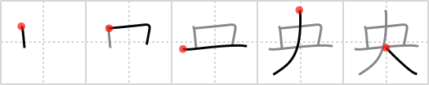

## `center`

## [5]

## Reading:

### On-Yomi: オウ

## Heisig story:

The elements depict a <i>St. Bernard</i> with its head and paws keeping their stick-like form, but with the middle or <b>center</b> of its body filled out in a box-like shape.

## Koohii stories:

1) [<a href="http://kanji.koohii.com/profile/pjhoover">pjhoover</a>] 6-11-2008(143): A person with a big mouth wants to be the<strong> center</strong> of attention.

2) [<a href="http://kanji.koohii.com/profile/thegeezer3">thegeezer3</a>] 30-8-2007(122): Youve got the st bernard dead centre in your sights (the box).

3) [<a href="http://kanji.koohii.com/profile/CharleyGarrett">CharleyGarrett</a>] 7-12-2006(13): You must get the explosive into the <strong>center</strong>. The armor will protect him otherwise. The key is to wait for the <em>mouth</em> of the <em>St. Bernard</em> to be open, and then fling the dynamite into the <strong>center</strong> of it.

4) [<a href="http://kanji.koohii.com/profile/dihutenosa">dihutenosa</a>] 19-12-2007(11): For the primitive, I&#039;ll try a <em>big</em> boxy <em>target</em> - like the kind you use to line up your enemy in a videogame before you blow it up. Here, though - you&#039;re given the opportunity to finally kill that <em>St Bernard</em> from <em>Duck Hunt</em> - just make sure to line it up in the <em>center</em> of your <em>target</em>...

5) [<a href="http://kanji.koohii.com/profile/gfb345">gfb345</a>] 20-7-2010(9): I see this as a modern-day pictogram for someone walking in carrying a big birthday cake, with one fat candle at its <strong>CENTRE</strong> (to remind me that the <strong>CENTRE</strong> vertical juts up from the &quot;cake&quot;), and to be placed at the <strong>CENTRE</strong> of a table, in honor of the person who&#039;s the day&#039;s <strong>CENTRE</strong> of attention. (I use the <strong>CENTRE</strong> instead of<strong> CENTER</strong> to promote the connection with <a href="../1741">England</a> (#1741 英), 英 .).

6) [<a href="http://kanji.koohii.com/profile/harusame">harusame</a>] 16-6-2009(4): A <em>person</em> with a <em>big mouth</em> insists on being the<strong> center</strong> of attention (tweaked from taikura).

7) [<a href="http://kanji.koohii.com/profile/Tzadeck">Tzadeck</a>] 19-8-2009(3): When you&#039;re getting attacked by a <em>St. Bernard</em> in a video game, you should aim at the<strong> center</strong> and shoot-- that&#039;s where the rectangular <em>hit box</em> is.

8) [<a href="http://kanji.koohii.com/profile/dmichaud">dmichaud</a>] 27-1-2013(2): Au <strong>centre</strong> de secours en montagne, les <em>Saint Bernard</em> ont une <em>boite</em> autour du cou.

9) [<a href="http://kanji.koohii.com/profile/Hoticehunter">Hoticehunter</a>] 28-2-2012(2): If you&#039;re curious about the stroke order, it goes the mouth/box primitive first with the third stroke for the mouth primitive overlapping with the first stroke of the big primitive.

10) [<a href="http://kanji.koohii.com/profile/taikura">taikura</a>] 11-12-2008(2): <strong>Center; middle.</strong> A <em>big mouth</em> insistes on being the<strong> center</strong> of attention.
