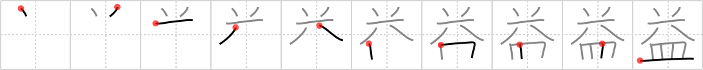

# {1881}

## `benefit`

## [10]

## Reading:

### On-Yomi: エキ、ヤク &mdash; Kun-Yomi: ま.す

### Examples: 有益 (ゆうえき), 利益 (りえき), 益する (まする), 益 (やく)

## Words:

収益(しゅうえき): earnings, proceeds, returns

益々(ますます): increasingly, more and more

有益(ゆうえき): beneficial, profitable

利益(りえき): profits, gains, (political, economic) interest
