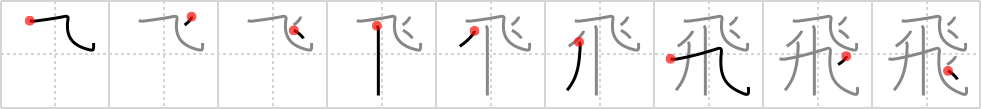

# {飛}

## `fly`

## Strokes: 9

## Reading:

### On-Yomi: ヒ &mdash; Kun-Yomi: と.ぶ、と.ばす、-と.ばす

### Examples: 飛ばす (と.ばす), 飛ぶ (と.ぶ)

## Words:

蹴飛ばす(けとばす): to kick away, to kick off, to kick (someone), to refuse, to reject

飛ばす(とばす): skip over, omit

飛び込む(とびこむ): jump in, leap in, plunge into, dive

飛び出す(とびだす): jump out, rush out, fly out, appear suddenly, protrude, project

飛行(ひこう): flying, flight, aviation

飛行場(ひこうじょう): airfield, airport

飛ぶ(とぶ): jump, fly, leap, spring, bound, hop

飛行機(ひこうき): airplane
