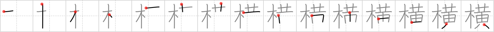

## `sideways`

## [15]

## Reading:

### On-Yomi: オウ &mdash; Kun-Yomi: よこ

## Heisig story:

Tree . . . yellow.

## Koohii stories:

1) [<a href="http://kanji.koohii.com/profile/Raichu">Raichu</a>] 3-4-2007(232): A tree went all yellow. It died and fell down, ending up<strong> sideways</strong>.

2) [<a href="http://kanji.koohii.com/profile/dingomick">dingomick</a>] 11-3-2007(75): In a horrible accident, a <em>yellow</em> schoolbus gets wrapped <strong>sideways</strong> around a <em>tree</em>.

3) [<a href="http://kanji.koohii.com/profile/mr_hans_moleman">mr_hans_moleman</a>] 23-11-2008(28): Imagine a TREE that grows BANANAS that is so heavy that it made the TREE fall<strong> SIDEWAYS</strong>.

4) [<a href="http://kanji.koohii.com/profile/theasianpleaser">theasianpleaser</a>] 13-12-2008(11): Guys only <em>pee</em><strong> sideways</strong> on <em>trees</em>, never up and down.

5) [<a href="http://kanji.koohii.com/profile/jabberwockychortles">jabberwockychortles</a>] 3-10-2009(8): The <em>tree</em> fell<strong> sideways</strong> and <em>yellow</em> fungis grew on it.

6) [<a href="http://kanji.koohii.com/profile/johnskb">johnskb</a>] 11-5-2006(6): A TREE, blown over by a wind storm, lies<strong> SIDEWAYS</strong> across a trail, its leaves beginning to turn YELLOW. (BTW If you learn Kanji from a 先生 , they will have you write out the strokes for a character and say たて (for standing (vertical) strokes and よこ (for<strong> SIDEWAYS</strong> strokes).

7) [<a href="http://kanji.koohii.com/profile/Viking101">Viking101</a>] 27-1-2010(4): Paul Giamatti is the star of the movie<strong> Sideways</strong>. In one of the deleted scenes, he got so drunk that he attacked a <em>tree</em> with the <em>Yellow</em> Pages.

8) [<a href="http://kanji.koohii.com/profile/redskatz">redskatz</a>] 5-4-2009(4): My friend and I played a game where one of us stands as rigid as a <em>tree</em> while the other throws a rock to try to hit the person from a fair distance away. My friend was able to do it (and I missed), but when my turn came, I moved <strong>sideways</strong>. He laughed and said I was <em>yellow</em>.

9) [<a href="http://kanji.koohii.com/profile/DanieljTAH">DanieljTAH</a>] 25-8-2011(3): If there is something <em>yellow</em> on the <em>tree</em>, you know a dog has been standing <strong>sideways</strong> next to it not too long ago.

10) [<a href="http://kanji.koohii.com/profile/HolyKotor">HolyKotor</a>] 11-8-2011(2): The weight of the <em>yellow</em> bananas cause the <em>tree</em> to bend over <strong>sideways</strong>.

### {V4: 1751, V6: 1888}
