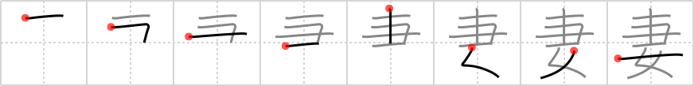

## `wife`

## [8]

## Reading:

### On-Yomi: サイ &mdash; Kun-Yomi: つま

### Examples: 妻 (つま)

## Words:

夫妻(ふさい): man and wife, married couple

妻(つま): wife

## Koohii stories:

1) [<a href="http://kanji.koohii.com/profile/thegeezer3">thegeezer3</a>] 30-8-2007(203): Ten rakes woman. your<strong> wife</strong> digs her fingernails into you and it feels like 10 rakes when she finds you ontop of another woman. 

2) [<a href="http://kanji.koohii.com/profile/TheSleeve">TheSleeve</a>] 8-11-2007(139): (I&#039;m really not sexist, this just helps me remember the kanji): I make my<strong> WIFE</strong> do all the yard work, and as a really mean joke, I bought her TEN RAKES for her birthday this year. &quot;Do the yardwork, WOMAN! You have TEN perfectly good RAKES to choose from!&quot;. 

3) [<a href="http://kanji.koohii.com/profile/Piitaa">Piitaa</a>] 23-7-2006(60): Your<strong> wife</strong>&#039;s fingernails are like ten rakes clawing into you. What a savage woman. 

4) [<a href="http://kanji.koohii.com/profile/dingomick">dingomick</a>] 14-3-2007(17): I have multiple <strong>wives</strong>. <em>Ten</em> to be exact. It makes it mighty easy to <em>rake</em> leaves in the fall. 

5) [<a href="http://kanji.koohii.com/profile/mistamark">mistamark</a>] 22-1-2009(13): Your<strong> wife</strong> hit you <em>10</em> times with a <em>rake</em> when she found you on top of another <em>woman</em>! 

6) [<a href="http://kanji.koohii.com/profile/Monkeys_Spiders">Monkeys_Spiders</a>] 5-12-2009(10): My lovely<strong> wife</strong> is in the guineas book of records, she can balance 10 rakes on her head and shoulders. (I kept forgetting the primitive positions). 

7) [<a href="http://kanji.koohii.com/profile/uberclimber">uberclimber</a>] 31-12-2010(9): <em>Ten Rakes Woman</em> is the name of my Native American<strong> wife</strong>, because she rakes around our teepee ten times every day.   <a href="http://jisho.org/kanji/details/妻">妻</a>   (つま) :<strong> wife</strong>;   <a href="http://jisho.org/kanji/details/夫妻">夫妻</a>   (ふさい) : man and<strong> wife</strong>, married couple. 

8) [<a href="http://kanji.koohii.com/profile/raulir">raulir</a>] 2-1-2007(8): <strong>Wife</strong> is a woman who pokes the ceiling with a rake so that the people above will stay quiet. This one obviously poked too hard. 

9) [<a href="http://kanji.koohii.com/profile/taikura">taikura</a>] 16-1-2009(4): A<strong> wife</strong> is a <em>woman</em> who takes care of the house and spends time brushing her hair with her <em>brush</em>. She has some power in the household, so people can&#039;t just walk all over her (unlike a concubine   <a href="http://jisho.org/kanji/details/妾">妾</a>  ). The contrast can be seen in the compound:   <a href="http://jisho.org/kanji/details/妻妾">妻妾</a>   (one&#039;s<strong> wife</strong> and mistresses). Both are <em>women</em>; however, the<strong> wife</strong> gets a <em>brush</em> for her hair; whereas the concubine is <em>stood</em> upon and trampled. 

10) [<a href="http://kanji.koohii.com/profile/kanjihito">kanjihito</a>] 30-1-2010(3): <em>Ten</em> <em>rakes</em> stand for the ten chores a <em>woman</em> takes on when becoming a<strong> wife</strong>. 
