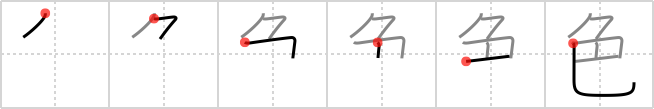

## `color`

## [6]

## Reading:

### On-Yomi: ショク、シキ &mdash; Kun-Yomi: いろ

## Heisig story:

Bound up . . . mosaic.

## Koohii stories:

1) [<a href="http://kanji.koohii.com/profile/synewave">synewave</a>] 17-11-2006(213): <em>Bound up</em> in the <em>Rubik&#039;s cube</em> are the 6 different <strong>colours</strong>.

2) [<a href="http://kanji.koohii.com/profile/Haych">Haych</a>] 22-11-2008(54): Ever look closely at <em>mosaic</em>s? They contain a bunch of images <em>bound up</em> into a larger one. It seems amazing until you realize that the only quality of the smaller images that really matters is their <strong>colour</strong>.

3) [<a href="http://kanji.koohii.com/profile/Dragg">Dragg</a>] 13-6-2008(39): A man and woman are BOUND UP in a<strong> color</strong>ful sex act. She bends over, legs tucked underneath, exposing her FULL MOON buttocks in order to be penetrated. *Heisigian liberties aside, this is what the kanji literally means. By reporting this story, you are reporting Japanese to be a naughty language in general.

4) [<a href="http://kanji.koohii.com/profile/cangy">cangy</a>] 23-2-2009(28): This kanji has a secondary meaning relating to sex (so stop reading now if you have issues) and originally showed a bending person (<em>bound up</em>) over another bending person (<em>mosaic</em>). This might help as an alternative to the <em>mosaic</em> primitive. (Say, <em>doggy-style</em>? Works ok for <a href="../1752">grasp</a> (#1752 把) &quot;<strong>grasp</strong> the love handles with your <em>fingers</em> during <em>doggy-style</em>&quot;, but I&#039;m not sure about <a href="../1756">fertilizer</a> (#1756 肥)...Oh, wait, how about &quot;be careful with your <em>flesh</em> during <em>doggy-style</em> of you might <strong>fertilize her</strong>&quot;? No? Oh well...).

5) [<a href="http://kanji.koohii.com/profile/Radii">Radii</a>] 2-4-2010(9): If you look into a kaleidoscope it&#039;s like a <em>bound up mosaic</em> of<strong> color</strong>.

6) [<a href="http://kanji.koohii.com/profile/Tzadeck">Tzadeck</a>] 19-8-2009(9): The thing that makes <em>Rubik&#039;s cubes</em> so hard is that the<strong> color</strong>s are <em>bound</em> together, and you can only move them in a certain way.

7) [<a href="http://kanji.koohii.com/profile/rayne">rayne</a>] 8-6-2009(6): A variety of<strong> color</strong>s are bound up into one mosaic painting.

8) [<a href="http://kanji.koohii.com/profile/Filip">Filip</a>] 2-3-2008(4): Bound up, rubic cube. Bind up as much rubic cube you can and you will get a very colourfull... thing.

9) [<a href="http://kanji.koohii.com/profile/bebio">bebio</a>] 24-9-2009(3): HINT--: <a href="http://www.kanjinetworks.com/eng/kanji-dictionary/online-kanji-etymology-dictionary.cfm?kanji_id=SAK18">http://www.kanjinetworks.com/eng/kanji-dictionary/online-kanji-etymology-dictionary.cfm?kanji_id=SAK18</a> (you are quite right, Dragg).

10) [<a href="http://kanji.koohii.com/profile/ikmys">ikmys</a>] 14-2-2007(3): When Japanese porn went to<strong> color</strong>, mosaics were strictly applied, and Japanese slowly turned to more fetishistic ways to satisfy their cravings: the binding s&amp;m genre so ubiquitous here.
