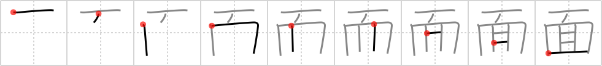

## `mask`

## [9]

## Reading:

### On-Yomi: メン、ベン &mdash; Kun-Yomi: おも、おもて、つら

## Heisig V6:

Imagine a <b>mask</b> over your head with <i>eyes</i> peeping out from all over the head, a <i>hundred</i> in all (the element for <i>eye</i> displacing the fifth stroke of that for <i>hundred</i>).

## Koohii stories:

1) [<a href="http://kanji.koohii.com/profile/Zactacular">Zactacular</a>] 4-10-2007(147): When Jim Carrey puts on <strong>The<strong> Mask</strong></strong>, he can make it seem like he has <em>100 eyes</em> popping out of his head.

2) [<a href="http://kanji.koohii.com/profile/phauna">phauna</a>] 27-2-2008(106): If you&#039;re wearing a<strong> mask</strong>, a <em>hundred</em> <em>eyes</em> can look at you but none of them will know who you are.

3) [<a href="http://kanji.koohii.com/profile/Monkeys_Spiders">Monkeys_Spiders</a>] 18-2-2010(46): I see this as the comb primitive combined with the kanji for 3 giving the same stroke order :). So picture a person wearing 3 combs on their face as a<strong> mask</strong>. メン.

4) [<a href="http://kanji.koohii.com/profile/Filip">Filip</a>] 7-3-2008(18): A<strong> mask</strong> with one big eye in the middle. (and a funny haircut on top).

5) [<a href="http://kanji.koohii.com/profile/mezbup">mezbup</a>] 7-7-2009(11): A<strong> mask</strong> with a hundred eyes.

6) [<a href="http://kanji.koohii.com/profile/Transtic">Transtic</a>] 2-9-2010(8): (Lilith, from Evangelion) <a href="http://www.evageeks.org/ANF-Archive/images/3ET2U743Q60CJ03LK4O2P9UAF-22_lilith-mask.jpg">http://www.evageeks.org/ANF-Archive/images/3ET2U743Q60CJ03LK4O2P9UAF-22_lilith-mask.jpg</a>.

7) [<a href="http://kanji.koohii.com/profile/sgrant">sgrant</a>] 18-1-2009(5): This is a pictograph of one of those foam Disney <strong>masks</strong> that some employees wear at Disneyland. The 1st stroke is the eyes of the<strong> mask</strong>, the 2nd stroke is the nose. You can see the <em>eyes</em> of the person peeking out of the <strong>mask&#039;s</strong> <em>mouth</em>.

8) [<a href="http://kanji.koohii.com/profile/Swashbuckler">Swashbuckler</a>] 20-10-2012(4): Well, I got to thank Christopher Nolan on this.<strong> Mask</strong> = Bane <a href="http://cdn.newsday.com/polopoly_fs/1.3842110.1342483408">http://cdn.newsday.com/polopoly_fs/1.3842110.1342483408</a>!/httpImage/image.jpg_gen/derivatives/display_600/image.jpg.

9) [<a href="http://kanji.koohii.com/profile/thermal">thermal</a>] 9-7-2008(4): You find the perfect cyclops<strong> mask</strong> for the party, yet on arrival you see that at least 100 other guys are wearing the same<strong> mask</strong>. There will be no hot sex for you.

10) [<a href="http://kanji.koohii.com/profile/jonusbalonus">jonusbalonus</a>] 28-5-2013(3): To<strong> mask</strong> his bald spot he attempted a <em>comb</em>-over, unfortunately he had only <em>three</em> strands of hair to <em>comb</em>-over... <a href="http://1.bp.blogspot.com/_GE-gADun97s/SHNUr4AMQCI/AAAAAAAAAeo/j03bF70GS5w/s400/comb-over.jpg">http://1.bp.blogspot.com/_GE-gADun97s/SHNUr4AMQCI/AAAAAAAAAeo/j03bF70GS5w/s400/comb-over.jpg</a> Thanks Monkeys Spiders.
