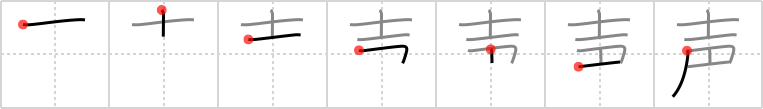

# {声}

## `voice`

## Strokes: 7

## Reading:

### On-Yomi: セイ、ショウ &mdash; Kun-Yomi: こえ、こわ-

### Examples: 声楽 (せいがく), 声援 (せいえん), 名声 (めいせい), 声 (こえ)

## Words:

歓声(かんせい): cheer, shout of joy

声明(せいめい): declaration, statement, proclamation

声(こえ): voice
