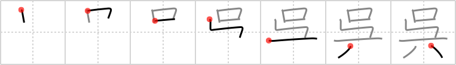

## `give`

## [7]

## Reading:

### On-Yomi: ゴ &mdash; Kun-Yomi: く.れる、くれ

## Koohii stories:

1) [<a href="http://kanji.koohii.com/profile/dingomick">dingomick</a>] 14-3-2007(262): As a present, I <strong>gave</strong> my dentist a <em>hand-crank tool</em> for spreading <em>mouths</em>. He was so happy since it makes his job easier. 

2) [<a href="http://kanji.koohii.com/profile/rgravina">rgravina</a>] 27-10-2006(66): I see this as a pictograph of an old-style phonograph - a stand, record, crank and bell (the mouth). Even the primitives work out - a <em>tool</em> with a <em>crank</em> which plays music out of the bell <em>mouth</em>. Imaginge <strong>giving</strong> one of these old and beautiful phonographs to a classical or jazz music buff! 

3) [<a href="http://kanji.koohii.com/profile/romanrozhok">romanrozhok</a>] 11-3-2008(55): This kanji does not mean &quot;give&quot; as in &quot;give to someone.&quot; It means &quot;give&quot; in the sense that someone gave you something, or did something for your benefit when combined with a gerund (-te/-de form) of a verb. STORY: Your working in a factory and your hand gets stuck in one of the gears. You yell with a big MOUTH, &quot;HELP!&quot; and one of your co-workers runs over,<strong> GIVE</strong>S YOU a HAND-CRANK TOOL, and goes back to work. =(. 

4) [<a href="http://kanji.koohii.com/profile/zazen666">zazen666</a>] 5-12-2007(10): Some dude is changing a flat tire. He opens his <em>mouth</em> to say, &quot;GIVE me that <em>tool</em>,...what was it called again? Oh yeah, a <em>tire iron</em>.&quot; (The forth stroke looks like a tire iron to me.). 

5) [<a href="http://kanji.koohii.com/profile/hunchbag">hunchbag</a>] 20-11-2009(8): I was going to<strong> give</strong> you a <em>hand-crank tool</em> but I eated it. :(. 

6) [<a href="http://kanji.koohii.com/profile/Piitaa">Piitaa</a>] 12-7-2006(8): The fourth stroke looks like stairs to me. Mouth shouting from upstairs: &quot;Hey,<strong> give</strong> me my tools will ya.&quot;. 

7) [<a href="http://kanji.koohii.com/profile/Raichu">Raichu</a>] 2-1-2010(7): This is a pictogram of a person sitting in a chair being<strong> give</strong>n a box. 

8) [<a href="http://kanji.koohii.com/profile/Lutzos">Lutzos</a>] 25-6-2010(6): I was<strong> give</strong>n a jack in the box as a present. As I turned the tool, a crank in the box sprung and a mouth flew directly in my face and gave me a kiss. Charming yet scary at the same time. 

9) [<a href="http://kanji.koohii.com/profile/gavin.schultz-ohkubo">gavin.schultz-ohkubo</a>] 4-7-2010(5): <strong>Give</strong>n that the Kanji Learner&#039;s Dictionary assigns this kanji the cool but useless keyword of &quot;Kingdom of Wu&quot;, I&#039;m guessing you&#039;re not actually going to see this kanji used much. 

10) [<a href="http://kanji.koohii.com/profile/Chaze">Chaze</a>] 3-2-2011(4): Dentist to nurse:<strong> Give</strong> me that mouth-cranking-tool! 
