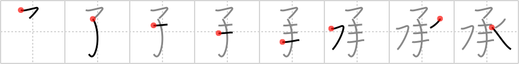

## `acquiesce`

## [8]

## Reading:

### On-Yomi: ショウ、ジョウ &mdash; Kun-Yomi: うけたまわ.る、う.ける、ささ.げる、とど.める、たす.ける、こ.らす、つい.で、すく.う

### Examples: 承る (うけたまわ.る)

## Words:

承諾(しょうだく): consent, acquiescence, agreement

了承(りょうしょう): acknowledgement, understanding (e.g. "please be understanding of the mess during our renovation")

承る(うけたまわる): (humble) hear, be told, know

承認(しょうにん): recognition, acknowledgement, approval, consent, agreement

承知(しょうち): consent, agree

## Koohii stories:

1) [<a href="http://kanji.koohii.com/profile/dingomick">dingomick</a>] 14-3-2007(222): To get someone to <em>completely</em> <strong>acquiesce</strong> it takes <em>3</em> dunks in the <em>water</em> before they give. 

2) [<a href="http://kanji.koohii.com/profile/Katsuo">Katsuo</a>] 25-10-2007(87): To get someone to<strong> acquiesce</strong>, duck them <em>completely</em> in <em>aqua</em> (=<em>water</em>) <em>three</em> times. (variation on dingomick&#039;s). 

3) [<a href="http://kanji.koohii.com/profile/Shibo">Shibo</a>] 8-7-2008(42): Warning, Obscene!! I finally got my girl to<strong> acquiesce</strong> to a lewd act.. But it took <em>3 times</em> to get it in <em>completely</em> and lots of <em>water</em> to clean up afterwards. 

4) [<a href="http://kanji.koohii.com/profile/nest0r">nest0r</a>] 28-4-2008(17): You must ask the trapped <em>water sprite</em> not once, not twice, but <em>thrice</em> (a line from Samuel Taylor Coleridge&#039;s &quot;Kubla Khan&quot; comes to mind) before it will<strong> acquiesce</strong> to your requests. It&#039;s not for any mystical reasons, it&#039;s just that it hates being asked the same thing <em>three</em> times, like that character from Austin Powers. 

5) [<a href="http://kanji.koohii.com/profile/koohiikun">koohiikun</a>] 30-11-2009(16): Waterboarding: To <em>completely</em><strong> acquiesce</strong> it usually takes just <em>three</em> sessions with <em>water</em>. (Thanks to dingomick for the idea.). 

6) [<a href="http://kanji.koohii.com/profile/bihzad">bihzad</a>] 8-5-2008(10): Princess Bride: scene with Fezzik dunking Inigo Montoya (three times) until he<strong> acquiesce</strong>s to completely stop drinking and find the Man in Black. 

7) [<a href="http://kanji.koohii.com/profile/Qroxxy">Qroxxy</a>] 7-8-2009(6): Elizabeth was disinclined to<strong> acquiesce</strong> to Barbosa’s request until he dunked her <em>complete</em>ly in the bilge<em>water</em> <em>three</em> times. (I know this story makes me a dork, but the line from the movie is all that pops into my head now when I hear the word “acquiesce.”). 

8) [<a href="http://kanji.koohii.com/profile/LazyNomad">LazyNomad</a>] 13-7-2009(5): This is a baptism submersion ritual. The <em>baby</em> should be <em>completely</em> submerged in the <em>water</em> <em>three</em> times . Quote from wikipedia: Eastern Orthodox Christians usually insist on <em>complete</em> <em>three</em>fold immersion as both a symbol of death and rebirth into Christ, and as a washing away of sin. (<a href="http://en.wikipedia.org/wiki/Baptism">http://en.wikipedia.org/wiki/Baptism</a>). Of course, the <em>baby</em> (is on the receiving end) and has no other option, but to<strong> acquiesce</strong>. + receive is the other meaning of   <a href="http://jisho.org/kanji/details/承">承</a>  . 

9) [<a href="http://kanji.koohii.com/profile/rowdyphantom">rowdyphantom</a>] 9-2-2010(4): After being <em>water</em> boarded for <em>three</em> days, the prisoner was willing to<strong> acquiesce</strong> <em>completely</em>. 

10) [<a href="http://kanji.koohii.com/profile/abdul">abdul</a>] 31-1-2012(3): Para que una persona acabe por consentir, solo hace falta sumergirla <em>tres</em> veces en <em>agua</em>. 
