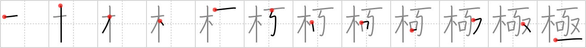

## `poles`

## [12]

## Reading:

### On-Yomi: キョク、ゴク &mdash; Kun-Yomi: きわ.める、きわ.まる、きわ.まり、きわ.み、き.める、-ぎ.め、き.まる

### Examples: 極限 (きょくげん), 終極 (おわりきょく), 積極的 (せっきょくてき), 極まる (きわ.まる), 極み (きわ.み), 極める (きわ.める)

## Words:

究極(きゅうきょく): ultimate, final, eventual

極端(きょくたん): extreme, extremity

極めて(きわめて): exceedingly, extremely

極楽(ごくらく): paradise

両極(りょうきょく): both extremities, north and south poles, positive and negative poles

極(ごく): pole, climax, extreme, extremity, culmination, height, zenith, nadir

消極的(しょうきょくてき): passive

積極的(せっきょくてき): positive, active, proactive

南極(なんきょく): south pole, Antarctic

北極(ほっきょく): North Pole

## Koohii stories:

1) [<a href="http://kanji.koohii.com/profile/Katsuo">Katsuo</a>] 13-4-2007(362): Can simplify this using <a href="../1243">decay</a> (#1243 <a href="http://jisho.org/kanji/details/朽">朽</a>). Then: The expedition to the<strong> poles</strong> is bad for your health, and the <em>decay</em> that started in your <em>mouth</em> spreads to your <em>crotch</em> – at which point you fall to the <em>floor</em>. 

2) [<a href="http://kanji.koohii.com/profile/rtkrtk">rtkrtk</a>] 17-3-2008(101): (modified Katsuo) Can simplify this using <a href="../1243">decay</a> (#1243 <a href="http://jisho.org/kanji/details/朽">朽</a>). You travel to the <em>poles</em>, a frozen wasteland. In desperate need of food you try to set up a snare but the tree is <em>decayed</em> (see story for <a href="../1243">decay</a> (#1243 <a href="http://jisho.org/kanji/details/朽">朽</a>)) so you catch no prey. The brutal cold first attacks your <em>mouth</em> as your lips turn blue, then your <em>crotch</em> also gets cold as your body fails; finally you fall to the <em>floor</em>. 

3) [<a href="http://kanji.koohii.com/profile/ayoung24">ayoung24</a>] 24-12-2006(20): Santa Claus (from the North <strong>Pole</strong>, of course), has a <em>wooden</em> sled led by reindeer <em>snared</em> at the <em>mouth</em>. One unfortunate night, he jumps down a chimney and burns his <em>crotch</em> on a piece of coal as he hits the <em>floor</em>. 

4) [<a href="http://kanji.koohii.com/profile/akrodha">akrodha</a>] 12-6-2007(7): The diverging magnetic fields at the<strong> poles</strong> actually attract cosmic radioactive <em>decay</em>, particularly the kind that causes cancer in the lips or the testicles. But don&#039;t worry, you can protect either your <em>mouth</em> or your <em>crotch</em> by digging a hole in the <em>ground</em> and covering it up. Which part do you protect? Imagine coming back home with cancer in the other, unprotected part. 

5) [<a href="http://kanji.koohii.com/profile/Aeryon">Aeryon</a>] 16-1-2012(4): I remember sharing this joke on the playground back in 1986. &quot;Did you ear about the dumb polak who climbed a tall tree to see both<strong> poles</strong>? On the way up, stepped in his own snare, fell to the floor and ended up with his crotch in his own mouth. Then he said seeing his own crotch in his mouth... that&#039;s not the pole I wanted to see!&quot;. 

6) [<a href="http://kanji.koohii.com/profile/thecite">thecite</a>] 13-1-2010(4): On the expedition to the <strong>poles</strong>, they <em>urgently</em> <a href="../20127">Unicode-0x4e9f</a> (#20127 <a href="http://jisho.org/kanji/details/亟">亟</a>) needed more <em>wood</em> to build shelters, make fires etcetera. 

7) [<a href="http://kanji.koohii.com/profile/jabberwockychortles">jabberwockychortles</a>] 17-10-2009(3): The<strong> poles</strong> each have a unique marker: the north <strong>pole</strong> simply has a <em>tree</em> to mark it. At the south <strong>pole</strong> was set a <em>snare</em> where an animal got caught and used its <em>mouth</em> to chew off it&#039;s <em>crotch</em> to escape. That&#039;s the marker at the south <strong>pole</strong>, the <em>floor</em> of the earth. 

8) [<a href="http://kanji.koohii.com/profile/mezbup">mezbup</a>] 7-7-2009(3): On our expedition to the<strong> poles</strong> our bodies were decaying rapidly... we were frozen from our mouths down to our crotches and then we passed out and fell to the floor. 

9) [<a href="http://kanji.koohii.com/profile/HydroKirby">HydroKirby</a>] 6-4-2012(2): I find it easier to remember the kanji components by some loose logic. The <em>tree</em> stands tall and straight like the axis through Earth. The <strong>poles</strong> are represented by lines on the top and bottom as North and South. On the left and right sides are   <a href="http://jisho.org/kanji/details/口">口</a>   and   <a href="http://jisho.org/kanji/details/又">又</a>   representing a 〇 and an X respectively; <strong>polar</strong> opposites meaning right and wrong. Put the <em>mouth</em> on the left side and you&#039;ll get the correct radical for the <em>snare</em>. 

10) [<a href="http://kanji.koohii.com/profile/Alunalun">Alunalun</a>] 11-8-2009(2): In some fantasy story the Earth&#039;s<strong> poles</strong> have extraordinary significance. The heroes must travel there, etc. At each <strong>pole</strong> there is a giant <em>tree</em>, green and blooming despite the freezing desert surrounding it. The adventurer approaches it, awestruck, but the tree is evil and has a talking <em>snare</em>, i.e. with a <em>mouth</em>. This whips down from the tree and grabs him by the <em>crotch of his arm</em>, laughing hauntingly. It wrestles him to the <em>ground</em>, and there it gives a speech about protecting the tree&#039;s magic. 
