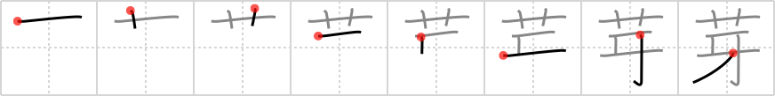

## `bud`

## [8]

## Reading:

### On-Yomi: ガ &mdash; Kun-Yomi: め

### Examples: 芽 (め)

## Words:

発芽(はつが): burgeoning

芽(め): sprout

## Koohii stories:

1) [<a href="http://kanji.koohii.com/profile/dingomick">dingomick</a>] 25-12-2007(217): Zoo keepers are baffled as to why the tips of the elephant&#039;s <em>tusks</em> keep <strong>budding</strong> into <em>flowers</em>. 

2) [<a href="http://kanji.koohii.com/profile/Raichu">Raichu</a>] 22-10-2007(57): <strong>Bud</strong>s while they&#039;re still small tend to be tusk-shaped. 

3) [<a href="http://kanji.koohii.com/profile/Virtua_Leaf">Virtua_Leaf</a>] 25-1-2008(31): An elephant places a big <em>flower</em> on the other elephant&#039;s <em>tusks</em>, to show they&#039;re best<strong> bud</strong>s. 

4) [<a href="http://kanji.koohii.com/profile/stupiddog">stupiddog</a>] 28-12-2009(13): Unfortunately, this must be a sad story. Poachers lure the elefants with <strong>buds</strong> (of <em>flowers</em>) so they can kill them to get their <em>ivory</em>. 

5) [<a href="http://kanji.koohii.com/profile/eightyd">eightyd</a>] 5-4-2010(12): Lets smoke some flower<strong> bud</strong> out of my tusk bong. 

6) [<a href="http://kanji.koohii.com/profile/Zactacular">Zactacular</a>] 6-10-2007(11): The mastodon uses its <em>tusks</em> to churn up the <em>flower</em><strong> bud</strong>s in the spring and eat them. 

7) [<a href="http://kanji.koohii.com/profile/Ricardo">Ricardo</a>] 6-7-2007(7): [bud; sprout; spear; germ] I just picture a detailed <em>flower</em> <strong>bud</strong> sculpture made out of an elephant&#039;s <em>tusk</em>. 

8) [<a href="http://kanji.koohii.com/profile/efeilliaid">efeilliaid</a>] 27-2-2010(5): The kanji for &quot;tusk&quot; may as well resemble a small elephant. So, a small elephant&#039;s<strong> bud</strong>s (nubs) become tusks later, but for now they are &quot;buds&quot;, which brings up the association with flowers. &quot;The <em>bud</em>ding tusks - actually &#039;nubs&#039; became a focal point in this my first sculpture.&quot; <a href="http://www.paintingsofwildlife.com/sculpture.html">http://www.paintingsofwildlife.com/sculpture.html</a>. 

9) [<a href="http://kanji.koohii.com/profile/chibimizuno">chibimizuno</a>] 30-4-2009(3): It became apparent that the baby girl elephant was<strong> bud</strong>ding into a young lady elephant when she starting wearing <em>flowers</em> on her <em>tusks</em>. 

10) [<a href="http://kanji.koohii.com/profile/erikkusan">erikkusan</a>] 4-4-2006(2): This animal&#039;s tusk is replaced with a flower<strong> bud</strong> that opens when it is about to eat something. 
