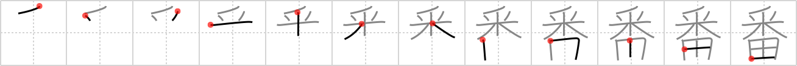

## `turn`

## [12]

## Reading:

### On-Yomi: バン &mdash; Kun-Yomi: つが.い

## Words:

下番(かばん): going off duty

番目(ばんめ): cardinal number suffix

順番(じゅんばん): turn (in line), order of things

当番(とうばん): being on duty

番地(ばんち): house number, address

留守番(るすばん): care-taking, caretaker, house-watching

番組(ばんぐみ): TV program

一番(いちばん): best, first, number one, a game, a round, a bout, a fall, an event (in a meet)

交番(こうばん): police box

番号(ばんごう): number, series of digits

## Koohii stories:

1) [<a href="http://kanji.koohii.com/profile/thegeezer3">thegeezer3</a>] 1-7-2007(211): The famers take it in<strong> turn</strong>s to watch out for any animal tracks on their rice field. 

2) [<a href="http://kanji.koohii.com/profile/Biene">Biene</a>] 4-5-2008(38): (modified thegeezer3) <em>Animal tracks</em> were found in the <em>rice field</em>, now the kids of the farmer take it in<strong> turn</strong>s to keep watch and hinder the animals to make more <em>animal tracks</em> in their precious <em>rice field</em>. They roll the <em>dice</em> to decide in what order they have to keep watch and when everyones<strong> turn</strong> is. 

3) [<a href="http://kanji.koohii.com/profile/Ricardo">Ricardo</a>] 7-7-2007(32): [turn; number in a series] Ok, I&#039;m done - now it&#039;s your <strong>turn</strong> to count the <em>drops</em> of <em>rice</em> in the <em>rice field</em>... 

4) [<a href="http://kanji.koohii.com/profile/gavin.schultz-ohkubo">gavin.schultz-ohkubo</a>] 20-11-2010(26): I find &quot;turn&quot; alone is too generic to remember, so I add an additional keyword, <strong>numerical order</strong>. This is perhaps the most common context in which this kanji is found, e.g. 1st, 2nd =   <a href="http://jisho.org/kanji/details/一番、二番">一番、二番</a>  . Story: I see <em>animal tracks</em> leading to the <em>rice field</em> and start to worry, but then see the <strong>numerical order</strong> in which the tracks are made:   <a href="http://jisho.org/kanji/details/一番">一番</a>  mouse tracks,   <a href="http://jisho.org/kanji/details/二番">二番</a>  　cat tracks,   <a href="http://jisho.org/kanji/details/三番">三番</a>  　dog tracks, then   <a href="http://jisho.org/kanji/details/四番">四番</a>  　lion tracks. Looks like the rice is safe. 

5) [<a href="http://kanji.koohii.com/profile/jimitha">jimitha</a>] 3-11-2009(11): (I use <em>animal droppings</em> instead of <em>animal tracks</em> to avoid confusion.) Story: Workers slack off in the <em>rice field</em> taking<strong> turn</strong>s at a dice game, using <em>animal droppings</em> as the dice (for lack of other implements). What game are they playing? Craps, of course. 

6) [<a href="http://kanji.koohii.com/profile/BlackMarsh">BlackMarsh</a>] 8-1-2006(10): The poor farmer found such a large number of animal tracks in his rice field,<strong> turn</strong>ing and circling all over the place, that he didn&#039;t know what to do. 

7) [<a href="http://kanji.koohii.com/profile/synewave">synewave</a>] 1-5-2007(5): I think of   <a href="http://jisho.org/kanji/details/何番目？">何番目？</a>   What (turn) number are you? - This is a kanji that I learned the traditional way. 

8) [<a href="http://kanji.koohii.com/profile/zaydana">zaydana</a>] 28-5-2009(4): The farmers fight over whos<strong> turn</strong> it is to watch for animal tracks in their rice field. &quot;Its your<strong> turn</strong> tonight!&quot; &quot;No, I did it last night!&quot;. 

9) [<a href="http://kanji.koohii.com/profile/NeoGlitch">NeoGlitch</a>] 5-11-2010(3): Yu-Gi-Oh デュル モンスタス: &quot;おれ の <strong>ターン</strong>！！ I activate a magic card: <em>Animal tracks</em>, ON my side of the <em>field</em>!!&quot;. 

10) [<a href="http://kanji.koohii.com/profile/Georgi87">Georgi87</a>] 26-4-2008(3): Winnie the Pooh and Piglet walking around and leaving footprints - but instead of walking around a tree, it&#039;s a rice field they&#039;re walking in, since this is Japan! (Recall the Pooh story about the tracks). 
