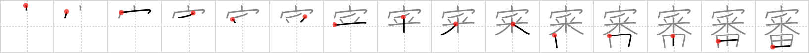

# {審}

## `hearing`

## Strokes: 15

## Reading:

### On-Yomi: シン &mdash; Kun-Yomi: つまび.らか、つぶさ.に

## Words:

審議(しんぎ): deliberation

審査(しんさ): judging, inspection, examination, investigation

審判(しんばん): refereeing, trial, judgement, umpire, referee

不審(ふしん): incomplete understanding, doubt, question, distrust, suspicion, strangeness, infidelity

審判(しんぱん): refereeing, trial, judgement, umpire, referee
