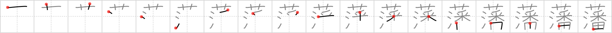

## `clan`

## [18]

## Reading:

### On-Yomi: ハン

## Koohii stories:

1) [<a href="http://kanji.koohii.com/profile/raulir">raulir</a>] 4-1-2007(165): This character refers to feudal<strong> clan</strong>s that were abolished in 1871 (Meiji 4) in favor of prefectures (  <a href="http://jisho.org/kanji/details/廃藩置県">廃藩置県</a>  ), and thus were predecessors of the modern prefectures. As we know from   <a href="http://jisho.org/kanji/details/落">落</a>  , flowers and water drops each have their own way of falling. This character says that<strong> clan</strong>s&#039; location was decided in the way flowers, water drops and dice fall: at random. See <a href="http://en.wikipedia.org/wiki/Han_%28country_subdivision%29">http://en.wikipedia.org/wiki/Han_%28country_subdivision%29</a>. 

2) [<a href="http://kanji.koohii.com/profile/Matthew">Matthew</a>] 17-3-2009(132): In the particular<strong> clan</strong> depicted by this character, each member has to take his or her <em>turn</em> <em>watering</em> the <em>flowers</em>. 

3) [<a href="http://kanji.koohii.com/profile/dwhitman">dwhitman</a>] 20-2-2008(83): Each member of the<strong> clan</strong> has to take his <em>turn</em> at <em>water</em>ing the <em>flowers</em>. The order they do it in is decided by a roll of the <em>dice</em>. (tweaked Matthew&#039;s story). 

4) [<a href="http://kanji.koohii.com/profile/laxxy">laxxy</a>] 30-10-2006(27): This yakuza<strong> clan</strong> controls the &quot;flower&quot; trade, the &#039;water business&#039; (  <a href="http://jisho.org/kanji/details/水商">水商</a>  ) and the dice gambling. 

5) [<a href="http://kanji.koohii.com/profile/erikkusan">erikkusan</a>] 5-4-2006(19): This is what members of Ku Klux<strong> Clan</strong> is doing when not meeting: pretending to live normal life by watering flowers during the day and playing dice-games with their families at night. What a double-life. 

6) [<a href="http://kanji.koohii.com/profile/pm215">pm215</a>] 31-8-2008(15): [A story for people using the flower+water = seaweed primitive; see <a href="http://forum.koohii.com/viewtopic.php?id=1079">http://forum.koohii.com/viewtopic.php?id=1079</a>] It&#039;s commonly known that Japan&#039;s old feudal <strong>clan</strong>s were rated by how much rice they produced. It&#039;s less well known that they were also rated for <em>seaweed</em> (the other component of sushi). Each year the shogun would roll <em>dice</em> to determine which<strong> clan</strong> had the honour of providing him with nori that year. 

7) [<a href="http://kanji.koohii.com/profile/theasianpleaser">theasianpleaser</a>] 19-12-2008(13): I am Conner McCloud of the<strong> Clan</strong> McCloud. Killed in a field of <em>flowers</em> and then thrown into the <em>water</em> by Sean Connery only to find it wasn&#039;t my <em>turn</em> to die. 

8) [<a href="http://kanji.koohii.com/profile/kanjihito">kanjihito</a>] 3-10-2011(7): Japan&#039;s old feudal<strong> clan</strong>s competed on making nori <em>seaweed</em>. They were all so good that picking the winner was like predicting the <em>roll of the dice</em>. See also <a href="../227">dilute</a> (#227 <a href="http://jisho.org/kanji/details/薄">薄</a>), <a href="../299">fall</a> (#299 <a href="http://jisho.org/kanji/details/落">落</a>), <a href="../2035">seaweed</a> (#2035 <a href="http://jisho.org/kanji/details/藻">藻</a>) and <a href="../1838">bulrush</a> (#1838 <a href="http://jisho.org/kanji/details/蒲">蒲</a>). 

9) [<a href="http://kanji.koohii.com/profile/delbertmon">delbertmon</a>] 26-1-2010(3): In this<strong> clan</strong>, they roll <em>dice</em> to determine whose <em>turn</em> it is to <em>water</em> the <em>flowers</em>. 

10) [<a href="http://kanji.koohii.com/profile/Viking101">Viking101</a>] 28-6-2009(3): I join a<strong> clan</strong> in World of Warcraft. Since I&#039;m the newest member, I have to water the flower garden. All the higher ranked players get to gamble with dice. It isn&#039;t fair. 
