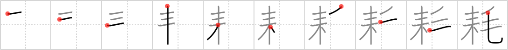

## `decrease`

## [10]

## Reading:

### On-Yomi: モウ、コウ、カウ

## Koohii stories:

1) [<a href="http://kanji.koohii.com/profile/raulir">raulir</a>] 4-1-2007(157): The amount of &quot;fur&quot; (needles) on a Christmas tree<strong> decrease</strong>s, until it doesn&#039;t look all that good. 

2) [<a href="http://kanji.koohii.com/profile/Filip">Filip</a>] 8-3-2008(115): Real fur coats and real christmas trees are dereasing the last couple of years. Plasctic chrismas trees and fake fur it is nowadays. 

3) [<a href="http://kanji.koohii.com/profile/kusterdu">kusterdu</a>] 30-4-2008(41): A marketing survey shows that there has been a<strong> decrease</strong> in Christmas trees sales. It turns out, many very stupid people confused a fir tree with a &quot;fur&quot; tree, and because &quot;fur is murder&quot; stopped buying the trees. 

4) [<a href="http://kanji.koohii.com/profile/chamcham">chamcham</a>] 20-12-2008(36): Christmas Tree + Fur: The<strong> decrease</strong> in the purchases of <em>furry christmas trees</em> is a result of protest from animal rights activists and nature lovers. 

5) [<a href="http://kanji.koohii.com/profile/dtstutz">dtstutz</a>] 15-2-2009(27): Sorry,<strong> decrease</strong> is too generic to remember... I bought my sister a <strong>de-creaser</strong> (a clothing maintenance device similar to an iron) after she complained about her <strong>fur coats</strong> getting all <strong>creased</strong> and wrinkled. But it was only November, so it had to sit for a while under the <strong>Christmas tree</strong> in a wrapped box waiting for someone to open it up and use it to <strong>de-crease</strong> something. 

6) [<a href="http://kanji.koohii.com/profile/rowdyphantom">rowdyphantom</a>] 9-2-2010(14): The temperature<strong> decrease</strong>d so much that even the <em>Christmas trees</em> needed to be wrapped in <em>fur</em>. 

7) [<a href="http://kanji.koohii.com/profile/jabberwockychortles">jabberwockychortles</a>] 19-12-2009(9): As the cat rubs against the trunk of the <em>christmas tree</em> her <em>fur</em><strong> decrease</strong>s. 

8) [<a href="http://kanji.koohii.com/profile/DurablePants">DurablePants</a>] 22-1-2007(8): During christmas, the thermometer<strong> decrease</strong>s and you must wear more fur. 

9) [<a href="http://kanji.koohii.com/profile/digicult">digicult</a>] 22-6-2009(5): &quot;Son, you&#039;d better<strong> decrease</strong> your masturbation before <em>Christmas</em>, or you&#039;ll have a<strong> decrease</strong> in the number of gifts, not to mention <em>hairy hands.</em> &quot;. 

10) [<a href="http://kanji.koohii.com/profile/kapalama">kapalama</a>] 20-3-2011(4):   <a href="http://jisho.org/kanji/details/消耗品">消耗品</a>  ,   <a href="http://jisho.org/kanji/details/消耗戦">消耗戦</a>  ,   <a href="http://jisho.org/kanji/details/減耗">減耗</a>  ,   <a href="http://jisho.org/kanji/details/摩耗">摩耗</a>  ,   <a href="http://jisho.org/kanji/details/損耗">損耗</a>  ,   <a href="http://jisho.org/kanji/details/心神耗弱者">心神耗弱者</a>  , <a href="../1914">decrease</a> (#1914 <a href="http://jisho.org/kanji/details/耗">耗</a>) モウ, コウ ... Parts: 耒,   <a href="http://jisho.org/kanji/details/毛">毛</a>   ... Similar Keywords:   <a href="http://jisho.org/kanji/details/減">減</a>  <a href="../366">dwindle</a> (#366 <a href="http://jisho.org/kanji/details/減">減</a>),   <a href="http://jisho.org/kanji/details/耗">耗</a>  <a href="../1914">decrease</a> (#1914 <a href="http://jisho.org/kanji/details/耗">耗</a>) ... Story: Using the actually meaning of <strong>Consumables wearing out</strong>: If you have a cat, you know this: <em>Xmas trees</em> just invite cats to rub up against them, the needles drop, the <em>Fur</em> wears away, both <strong>Decrease</strong> until you have a bald cat and a bald <em>Xmas tree</em>. 
