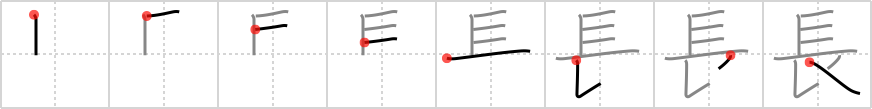

## `long`

## [8]

## Reading:

### On-Yomi: チョウ &mdash; Kun-Yomi: なが.い、おさ

## Koohii stories:

1) [<a href="http://kanji.koohii.com/profile/Zactacular">Zactacular</a>] 7-10-2007(152): The Geisha with<strong> long</strong> <em>hair</em> uses an ornate lacquered <em>hairpin</em> to bundle it all up. 

2) [<a href="http://kanji.koohii.com/profile/Shibo">Shibo</a>] 22-6-2008(74): The top of this one reminds me of the staple primitive. So here&#039;s my story: The girl&#039;s hair was so<strong> long</strong> that she had to use <em>staples</em> instead of <em>hairpins</em>. It worked, but stapling her hair to her head was kinda painful. 

3) [<a href="http://kanji.koohii.com/profile/fuaburisu">fuaburisu</a>] 5-1-2006(25): As a primitive I use the image of (very)<strong> long</strong> hair. Let this kanji represent a &quot;Swiss Hairpin&quot; (similar to a Swiss army knife) : the top part being a pictogram for <em>half a comb</em>, and the lower part being the <em>hairpin</em>. Just make sure not to confuse with the kanji for &quot;comb&quot;. Think of this one as a &quot;<em>half a comb</em>&quot; that can be pulled from the &quot;Swiss Hairpin&quot;. 

4) [<a href="http://kanji.koohii.com/profile/romanrozhok">romanrozhok</a>] 12-3-2008(14): HAIRPIN: This is rather similar to that for SCARF. Both a HAIRPIN and a SCARF can be used for holding back<strong> long</strong> hair. STORY: The first 4 strokes could be a pictograph of hair blowing in the wind. It&#039;s too<strong> LONG</strong> and getting in your way, so you pin it back. 

5) [<a href="http://kanji.koohii.com/profile/koohiikun">koohiikun</a>] 30-11-2009(8): The<strong> long</strong> haired Geisha <em>staples</em> on an ornate <em>hairpin</em> so it won&#039;t slip. (Thanks to Zactacular for the idea.). 

6) [<a href="http://kanji.koohii.com/profile/BobDG">BobDG</a>] 5-1-2011(6): A<strong> long</strong> mane needs a hairpin. 

7) [<a href="http://kanji.koohii.com/profile/amillerchip">amillerchip</a>] 2-1-2012(4): <strong>Primitives</strong>: The first 5 strokes are <em>mane</em>. The last 4 strokes are <em>hairpin</em>. As a whole, the <em>hairpin</em> can be replaced with <em>elbow</em> to form <em>hair</em>. <strong>Story</strong>: The lion&#039;s <em>mane</em> was so<strong> long</strong>, he had to tie it back with a <em>hairpin</em> (just don&#039;t knock it off with your <em>elbow</em> because then you&#039;ll get <em>hair</em> everywhere). 

8) [<a href="http://kanji.koohii.com/profile/tristanthorn">tristanthorn</a>] 4-9-2010(3): <em>hairpin</em> primitive: My hair-pin is made from organic materials. You can even <em>half-eat</em> it! (The bottom half is the last three strokes from <a href="../1472">eat</a> (#1472 <a href="http://jisho.org/kanji/details/食">食</a>)). 

9) [<a href="http://kanji.koohii.com/profile/DrJones">DrJones</a>] 29-3-2008(3): This primitive also gets the meaning <strong>Boss</strong>, in the idea that the boss used to be the most aged man (the one with the <strong>long</strong>est hair). Knowing this meaning might be useful for later stories. 

10) [<a href="http://kanji.koohii.com/profile/mairov">mairov</a>] 16-3-2008(3): <strong>Long</strong> means nagai   <a href="http://jisho.org/kanji/details/長い">長い</a>  ... 
