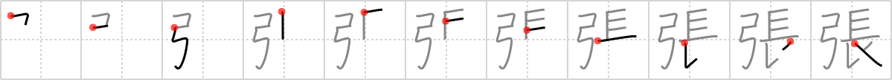

## `lengthen`

## [11]

## Reading:

### On-Yomi: チョウ &mdash; Kun-Yomi: は.る、-は.り、-ば.り

### Examples: 張る (は.る)

## Words:

嵩張る(かさばる): to be bulky, to be unwieldy, to grow voluminous

誇張(こちょう): exaggeration

突っ張る(つっぱる): to support, to become stiff, to become taut, to thrust (ones opponent), to stick to (ones opinion), to insist on

張り紙(はりがみ): paper patch, paper backing, poster

矢っ張り(やっぱり): also, as I thought, still, in spite of, absolutely

威張る(いばる): swagger, be proud

拡張(かくちょう): expansion, extension, enlargement, escape

緊張(きんちょう): tension, mental strain, nervousness

主張(しゅちょう): claim, request, insistence, assertion, advocacy, emphasis, contention, opinion, tenet

出張(しゅっちょう): official tour, business trip

張り切る(はりきる): be in high spirits, be full of vigor, be enthusiastic, be eager, stretch to breaking point

張る(はる): to stick, paste, put, affix, stretch, spread, strain, stick out, slap, be expensive, tighten

引っ張る(ひっぱる): pull, draw, stretch, drag

欲張り(よくばり): avarice, covetousness, greed

## Koohii stories:

1) [<a href="http://kanji.koohii.com/profile/rgravina">rgravina</a>] 29-10-2006(238): The longbow is follows the design of a standard <em>bow</em>, only it has been<strong> lengthen</strong>ed. 

2) [<a href="http://kanji.koohii.com/profile/johnzep">johnzep</a>] 14-8-2007(71): <em>Legolas</em> recieves spam telling him that his can <strong>lengthen</strong> his &quot;bow&quot;...he smirks...he know&#039;s it&#039;s already <em>long</em> enough. 

3) [<a href="http://kanji.koohii.com/profile/aircawn">aircawn</a>] 28-2-2007(18): Wanna<strong> lengthen</strong> the distance you can shoot? Use a <em>longbow</em>! 

4) [<a href="http://kanji.koohii.com/profile/Zactacular">Zactacular</a>] 7-10-2007(13): In desperation, after the <em>Geisha</em> (see long) broke the string on her <em>bow</em>, she<strong> lengthen</strong>ed out one of her own hairs and strung the bow with it. 

5) [<a href="http://kanji.koohii.com/profile/tristanthorn">tristanthorn</a>] 18-3-2009(10): To make your <em>bow</em> into a <em>long</em>bow, just<strong> lengthen</strong> it. 

6) [<a href="http://kanji.koohii.com/profile/Renaissance">Renaissance</a>] 10-3-2010(7): (I use Longcat as element for the &#039;long&#039; element) This is the story how longcat got<strong> lengthen</strong>ed from a normal cat to longcat. She always wanted to be a marksman, but she was not long enough to use a longbow like them. So she asked her owner to stretch and<strong> lengthen</strong> her everyday (like this: <a href="http://i86.photobucket.com/albums/k90/superfudge73/longcat.jpg">http://i86.photobucket.com/albums/k90/superfudge73/longcat.jpg</a> ), and then she became longcat. (really good at shooting a longbow). 

7) [<a href="http://kanji.koohii.com/profile/usis35">usis35</a>] 10-3-2013(3): Ok, this is the game: You have to make up words<strong> LENGTHEN</strong>ING the O&#039;s........Let&#039;s go: BOOOOOW LOOOOONG. 

8) [<a href="http://kanji.koohii.com/profile/kanjihito">kanjihito</a>] 15-1-2012(3): <strong>Lengthen</strong> the bow into a long bow by making the <em>bow</em> <em>long</em>. 

9) [<a href="http://kanji.koohii.com/profile/yuriehoshii">yuriehoshii</a>] 1-6-2011(2): TRƯƠNG :<strong> LENGTHEN</strong> THE BOW TO TAKE A LONGEST SHOOT. 

10) [<a href="http://kanji.koohii.com/profile/mspertus">mspertus</a>] 19-10-2010(2): To<strong> lengthen</strong> your hair into <em>long hair</em>, string a <em>bow</em> tightly with it, and the tension of the bow, will<strong> lengthen</strong> it. I&#039;m not quite sure how to get it back on you hair, though... 
