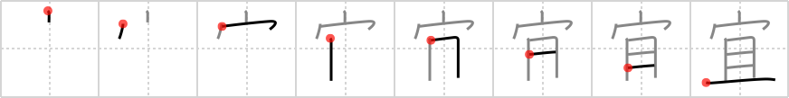

## `best regards`

## [8]

## Reading:

### On-Yomi: ギ &mdash; Kun-Yomi: よろ.しい、よろ.しく

## Heisig story:

This kanji, a polite way of expressing one's <b>best regards</b> to another. Its elements: <i>house</i> . . . <i>shelf</i>.

## Koohii stories:

1) [<a href="http://kanji.koohii.com/profile/akrodha">akrodha</a>] 5-6-2007(256): It seems like every time my Japanese friends send me their<strong> best regards</strong>, they accompany them with a gift. Over time, I&#039;ve gotten so many that I had to buy a <em>second house</em> which contains nothing but <em>several fancy shelves</em>. Each shelf is dedicated to a certain friend of mine and contains every last one of their presents.

2) [<a href="http://kanji.koohii.com/profile/thegeezer3">thegeezer3</a>] 16-6-2007(40): Noone in japan will admit to this but every house has a secret &quot;best regards shelf&quot; hidden away somewhere. Its a shelf full of the tat they are constantly giving each other on return from holidays etc. Heres the house wife looking over her shoulder for the all clear to put another useless present on the<strong> best regards</strong> shelf. Happy Circumcision and<strong> best regards</strong>. Shelved.

3) [<a href="http://kanji.koohii.com/profile/Odieone">Odieone</a>] 18-1-2009(28): The <em>shelf</em> your dad made for my <em>house</em> was fantastic. Give my<strong> best regards</strong> to him.

4) [<a href="http://kanji.koohii.com/profile/stupiddog">stupiddog</a>] 26-12-2009(11): When I brought my new <em>IKEA shelf</em> Billy into my <em>house</em>, the assembly instructions read: &quot;This will be the nightmare of your life. <strong>Best regards</strong> - IKEA.&quot;.

5) [<a href="http://kanji.koohii.com/profile/Machine_Gun_Cat">Machine_Gun_Cat</a>] 22-3-2009(6): You are stepping over the threshold of you&#039;re new Japanese homestay <em>house</em> You&#039;re half way through delivering your<strong> best regards</strong> in REALLY crap Japanese &quot; d d d <a href="http://google.com/#q=どうぞう宜しく”">どうぞう宜しく”</a> When you accidentally knock over their shelf where they keep their valuable ornaments with a terrible CRASH, not the best first impression.

6) [<a href="http://kanji.koohii.com/profile/Filip">Filip</a>] 2-3-2008(6): <a href="http://google.com/#q=宜しくお願いします、よろしくおねがいします。">宜しくお願いします、よろしくおねがいします。</a> please help me. To a Japanese person passing by. &#039;Can you please help me carry this shelf into the house? yoroshiku onegaishimasu&#039; Japanese always try to help you out, even it they cant (the suckers)...

7) [<a href="http://kanji.koohii.com/profile/swaarm">swaarm</a>] 3-7-2012(5): When I moved into my new <em>house</em>, I found a brand new <em>shelf</em> waiting for me with a note &quot;<strong>Best Regards</strong> - your new landlord&quot;.

8) [<a href="http://kanji.koohii.com/profile/Terhorst">Terhorst</a>] 24-12-2007(5): <strong>Best regards</strong> to the bride and the groom. May their <em>house</em> and their <em>shelves</em> always be full.

9) [<a href="http://kanji.koohii.com/profile/Peppi">Peppi</a>] 4-9-2009(3): When she moved out after a quarrel all she left in the <em>house</em> was an <em>empty shelf</em>. Her last words: &quot;My dear, sorry!<strong> Best regards</strong>, your ex-girlfriend!&quot;.

10) [<a href="http://kanji.koohii.com/profile/Puchatek">Puchatek</a>] 14-5-2011(2): Each <em>shelf</em> from IKEA contains a little note saying &quot;We loved it that you now own an IKEA <em>shelf</em> in your <em>house</em>./Best regards/IKEA people&quot;.

### {V4: 1783, V6: 1922}
