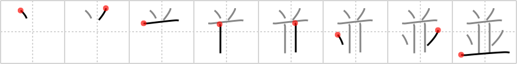

## `row`

## [8]

## Reading:

### On-Yomi: ヘイ、ホウ &mdash; Kun-Yomi: な.み、なら.べる、なら.ぶ、なら.びに

## Heisig story:

This character represents a slightly stylized duplication of the kanji for <i>stand up</i>. By lengthening the sixth and seventh strokes, you will see how this is done.

## Koohii stories:

1) [<a href="http://kanji.koohii.com/profile/Raichu">Raichu</a>] 8-6-2007(290): This is a simplification of 竝, a ideogram of <em>two</em> people <em>standing</em> in a<strong> row</strong>.

2) [<a href="http://kanji.koohii.com/profile/fuaburisu">fuaburisu</a>] 12-1-2006(53): Hint : as a primitive I use the image of a<strong> row</strong>ing boat. In a<strong> row</strong>ing boat people sit in<strong> row</strong>s, but also side-by-side (another meaning of the kanji), working together (yet another meaning of this kanji). Note : there will also be a kanji for &quot;rowboat&quot; coming at frame 1876. The<strong> row</strong>ing boat is associated with the sport, and is a primitive, while the kanji for &quot;rowboat&quot; has a generic meaning of &quot;a small boat&quot;. In any case, the kanji for &quot;rowboat&quot; will not appear as a primitive in the book.

3) [<a href="http://kanji.koohii.com/profile/bkvogel">bkvogel</a>] 17-9-2008(37): Roman numeral II with 2<strong> row</strong>s of animal horns.

4) [<a href="http://kanji.koohii.com/profile/sgrant">sgrant</a>] 18-7-2009(22): <strong>Full form:</strong> The image of a <em>viking longboat</em> has the advantage of being both a pictograph and lending to the idea of <em>rowing</em>. <strong>Flattened form:</strong> Here, we simply take the action of <em>rowing</em>, already reinforced by the previous image. <strong>Upside-down-in-a-row form:</strong> The horns on the top of this form follows the other forms as an image of a <em>Viking Berserker</em> with his horned helmet.

5) [<a href="http://kanji.koohii.com/profile/radical_tyro">radical_tyro</a>] 14-7-2007(15): Pictograph of the standing<strong> row</strong> in a theatre. // Primitive: a<strong> row</strong> of standing penguins (since they can&#039;t sit). If it&#039;s in the top position, the penguins are in a<strong> row</strong> in a balcony above the stage. If it&#039;s in the bottom position, the penguins are in the front<strong> row</strong>, lower than the stage. If the top 3 strokes are moved to the bottom (&quot;upside down in a<strong> row</strong>&quot;), then the penguins are in a<strong> row</strong> doing headstands.

6) [<a href="http://kanji.koohii.com/profile/mantixen">mantixen</a>] 10-7-2009(4): Moviegoers sit in<strong> row</strong>s on the opening day of Star Wars <em>II</em>, the <em>horny</em> ones eager to leave <em>drops</em> when Queen Amadala comes on screen. (This kanji even looks kinda like Darth Maul. I&#039;ll give it the primitive meaning <em>Star Wars</em>, and once the horny bastards leave, it&#039;ll just be a <em>movie theater</em>).

7) [<a href="http://kanji.koohii.com/profile/happychair">happychair</a>] 20-5-2006(4): To make a<strong> ROW</strong> of HORNED ANIMALS, use a couple of WALKING STICKS to coax them, but watch out for their DROPpings on the FLOOR.

8) [<a href="http://kanji.koohii.com/profile/Aeryon">Aeryon</a>] 13-1-2012(2): <strong>Row</strong>..? This ain&#039;t no<strong> row</strong> it be the Mighty Morphin&#039; Power Rangers! When it be on top... it be their Megazord... when it be in the middle, its thier Dinozords all in a<strong> row</strong> and when you see the kanji like it is here... it be them kicking ass in human form... &quot;<em>GO GO POWER RANGERS!!!</em>&quot;.

9) [<a href="http://kanji.koohii.com/profile/j0k0m0">j0k0m0</a>] 16-10-2010(2): 並 へい hey hey hey hey hey ... <a href="midori://search?text=並並並並並。。。">並並並並並。。。</a> sing it ... all lined up in a<strong> row</strong>. also: 並木 なみき road side trees lined up、 並ぶ ならぶ to line up.

10) [<a href="http://kanji.koohii.com/profile/Tzadeck">Tzadeck</a>] 19-8-2009(2): I also use <strong>two penguins</strong> as the primitive. However, when it&#039;s on top with the weird shape it will specifically be <strong>Penpen</strong> from Evangelion (as a warm-water penguin, he&#039;s slightly different). Note: this is the kanji for stand twice and combined.
