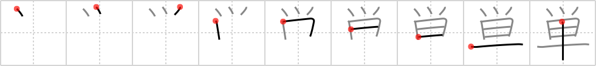

# {単}

## `simple`

## Strokes: 9

## Reading:

### On-Yomi: タン &mdash; Kun-Yomi: ひとえ

## Words:

単一(たんいつ): single, simple, sole, individual, unitory

単調(たんちょう): monotony, monotone, dullness

単独(たんどく): sole, independence, single, solo (flight)

単(ひとえ): one layer, single

単位(たんい): unit, denomination, credit (in school)

単語(たんご): word, vocabulary, (usually) single-character word

単純(たんじゅん): simplicity

単数(たんすう): singular (number)

単なる(たんなる): mere, simple, sheer

単に(たんに): simply, merely, only, solely

簡単(かんたん): easy, simple
