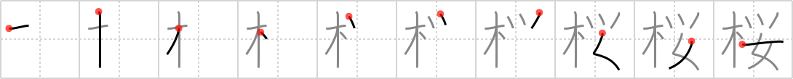

## `cherry tree`

## [10]

## Reading:

### On-Yomi: オウ、ヨウ &mdash; Kun-Yomi: さくら

## Heisig story:

Tree . . . owl . . . woman.

## Koohii stories:

1) [<a href="http://kanji.koohii.com/profile/Zactacular">Zactacular</a>] 7-10-2007(223): I was taking a picture of my <em>girlfriend</em> under the<strong> cherry tree</strong> during 花見 , when an <em>owl</em> happened to poop on her at the exact moment the shutter snapped. It&#039;s really my favorite picture , just don&#039;t tell her that.

2) [<a href="http://kanji.koohii.com/profile/dukelexon">dukelexon</a>] 16-2-2008(138): The <em>tree</em> in Japan that represents both wisdom (the <em>owl</em>) and femininity (the <em>woman</em>). This is a sakura (さくら), or<strong> cherry tree</strong>.

3) [<a href="http://kanji.koohii.com/profile/nolusu">nolusu</a>] 8-9-2007(40): Athena seating against a<strong> cherry tree</strong> with her owl on her shoulder. She is picking cherries and feeding her owl.

4) [<a href="http://kanji.koohii.com/profile/Katsuo">Katsuo</a>] 13-4-2007(18): The <em>woman</em> has trained her pet <em>owl</em> to fly to the <em>tree</em> (a<strong> cherry tree</strong>) and bring her back cherries.

5) [<a href="http://kanji.koohii.com/profile/kanjihito">kanjihito</a>] 3-6-2012(11): &quot;There is a <em>tree</em>,&quot; said the wise <em>owl</em>, &quot;where a <em>woman</em> may regain her virginity: the<strong> cherry tree</strong>&quot;.

6) [<a href="http://kanji.koohii.com/profile/mspertus">mspertus</a>] 3-10-2006(10): It turns out that<strong> cherry tree</strong> that George Washington cut down was the home of the last <em>female</em> of an endangered <em>owl</em> species, wiping out the species. Instead of growing up to be President, he spent his life in jail. Subsequent presidents have learned it&#039;s better to deflect the blame than tell the truth.

7) [<a href="http://kanji.koohii.com/profile/fuaburisu">fuaburisu</a>] 13-1-2006(3): There is a<strong> cherry tree</strong> just outside of the first Japanese outlet of <em>Hooters Restaurants</em>. Each year, when the<strong> cherry tree</strong> blossoms, they have a photo of the personnel, with one American <em>Hooters Girl</em> standing in the middle, and the Japanese <em>women</em> staff on the sides.

8) [<a href="http://kanji.koohii.com/profile/lecz0r">lecz0r</a>] 10-8-2011(2): They dont call it the<strong> CHERRY TREE</strong> for no reason - its the TREE that WISE WOMEN ought to avoid. (due to loss of virginity).

9) [<a href="http://kanji.koohii.com/profile/akrodha">akrodha</a>] 14-6-2007(2): For some reason, I picture <em>Mr. Owl</em> flying from a<strong> cherry tree</strong> and attacking a poor little <em>girl</em> who is innocently licking her cherry-flavored Tootsie Pop. How many licks does it take to get to the Tootsie-Roll center?

10) [<a href="http://kanji.koohii.com/profile/KanjiHantaa">KanjiHantaa</a>] 21-4-2013(1): El <strong>cerezo</strong> es un <em>árbol</em> que en Japón representa la sabiduría del <em>búho</em> y la feminidad de la <em>mujer</em>.
