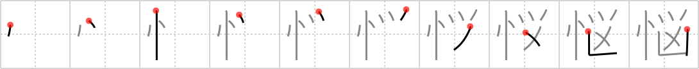

## `trouble`

## [10]

## Reading:

### On-Yomi: ノウ &mdash; Kun-Yomi: なや.む、なや.ます、なや.ましい、なやみ

## Koohii stories:

1) [<a href="http://kanji.koohii.com/profile/darg_sama">darg_sama</a>] 9-10-2005(123): The owl villain is the one that<strong> trouble</strong>s me most of all the super-villains. He&#039;s just so smart... you never know what he&#039;ll do! Definitely enough to put you in a<strong> trouble</strong>d state of mind. 

2) [<a href="http://kanji.koohii.com/profile/vosmiura">vosmiura</a>] 24-12-2007(41): <em>Data&#039;s</em> brain quickly allerts him to the state of<strong> trouble</strong> when he see&#039;s the <em>brainy owl villain</em>. 

3) [<a href="http://kanji.koohii.com/profile/samueruht">samueruht</a>] 17-2-2008(39): You have<strong> trouble</strong>s in the <em>brain</em>, not in the <em>part of the body</em> but in your <em>state of mind</em>. (see <a href="../1934">brain</a> (#1934 <a href="http://jisho.org/kanji/details/脳">脳</a>)). 

4) [<a href="http://kanji.koohii.com/profile/rtkrtk">rtkrtk</a>] 4-3-2008(29): <em>Data</em> has a solution to the <em>trouble</em> with tribbles. He releases <em>owls</em> which are natural predators of the <em>villains</em>: the tribbles and the Klingons who smuggled them in. 

5) [<a href="http://kanji.koohii.com/profile/Balaam">Balaam</a>] 5-2-2008(24): We&#039;re all in<strong> trouble</strong> if a wise owl has a change in it&#039;s state of mind and becomes a villian. 

6) [<a href="http://kanji.koohii.com/profile/penne">penne</a>] 22-4-2008(15): <em>Data</em> finds a <em>villan</em> getting his brain picked out by an <em>owl</em>. &quot;Looks like you&#039;re having some<strong> trouble</strong>&quot; says <em>Data</em>. 

7) [<a href="http://kanji.koohii.com/profile/blannk">blannk</a>] 7-3-2010(10): Two types of<strong> trouble</strong> you can have with your brain: one, as in   <a href="http://jisho.org/kanji/details/脳">脳</a>   <a href="../1934">brain</a> (#1934 <a href="http://jisho.org/kanji/details/脳">脳</a>), is with the physical brain itself, the actual <em>body part</em>; the other, as here, is psychological, involves your <em>state of mind</em>. The solution in both cases, as RtK has it, involves the wisdom of the <em>owl</em> overcoming the <em>villain</em>y of the<strong> trouble</strong>. 

8) [<a href="http://kanji.koohii.com/profile/jabberwockychortles">jabberwockychortles</a>] 9-2-2010(6): The <em>state of mind</em> of the <em>vilian</em> with the <em>owl</em> on his shoulder is to cause<strong> trouble</strong>. 

9) [<a href="http://kanji.koohii.com/profile/tristanthorn">tristanthorn</a>] 5-9-2010(5): When <em>Data</em> is<strong> trouble</strong>d, he punches <em>owl</em>s. The <em>villain</em>! (only pretend holodeck owls though). 

10) [<a href="http://kanji.koohii.com/profile/Virtua_Leaf">Virtua_Leaf</a>] 19-10-2009(5): <strong>Trouble</strong>d is the <em>state of mind</em> of the mouse as the <em>owl villain</em> attempts to scoop it with it&#039;s talons. 
