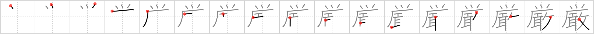

# {厳}

## Strokes: 17

## Reading:

### On-Yomi: ゲン、ゴン &mdash; Kun-Yomi: おごそ.か、きび.しい、いか.めしい、いつくし

### Examples: 厳格 (げんかく), 厳重 (げんじゅう), 威厳 (いげん), 厳か (おごそ.か), 厳しい (きび.しい)

## Words:

厳か(おごそか): austere, majestic, dignified, stately, awful, impressive

厳密(げんみつ): strict, close

厳重(げんじゅう): strict, severe, firm, strong, secure, rigour

厳しい(きびしい): strict
